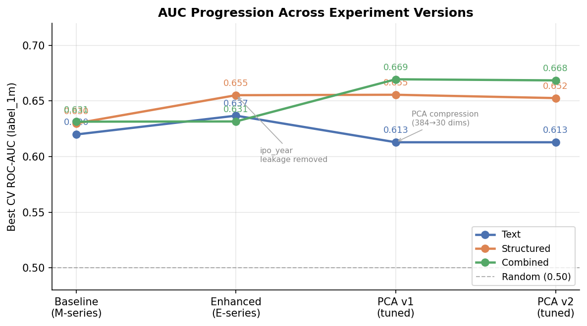
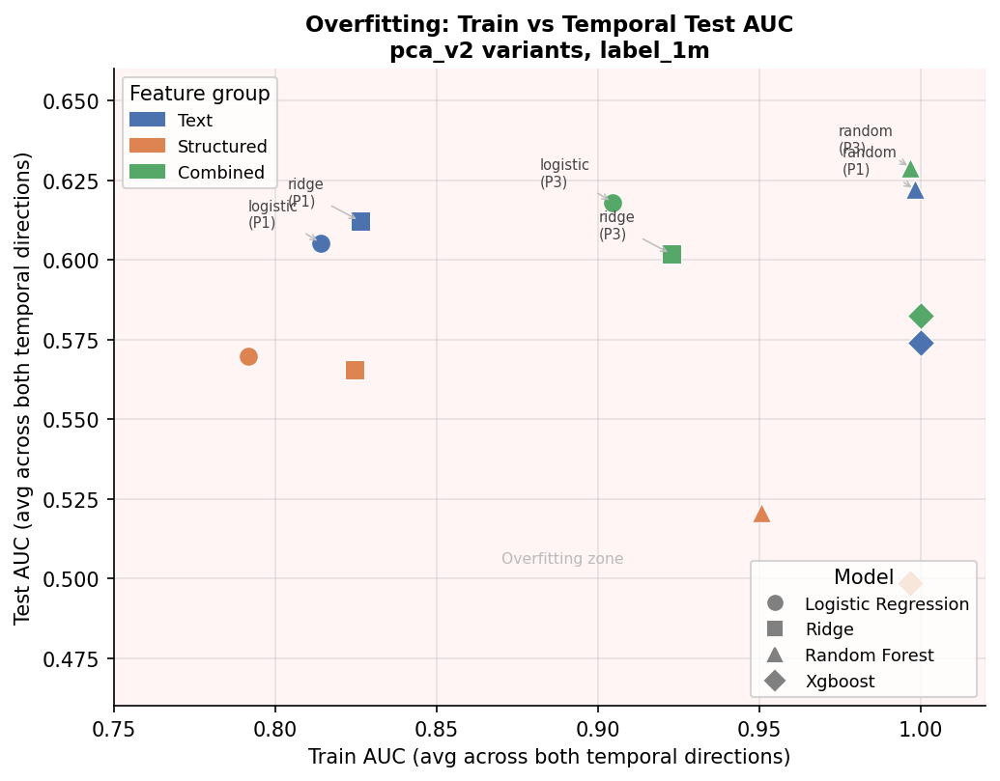
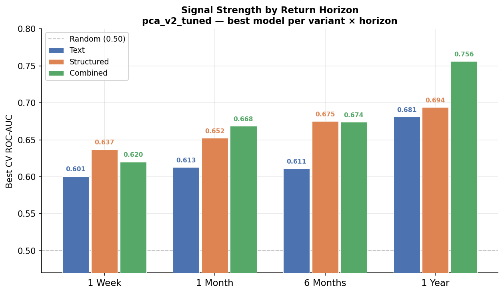
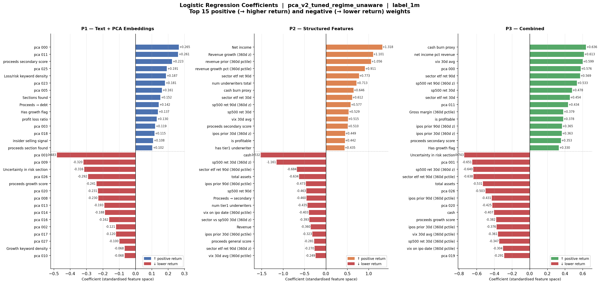
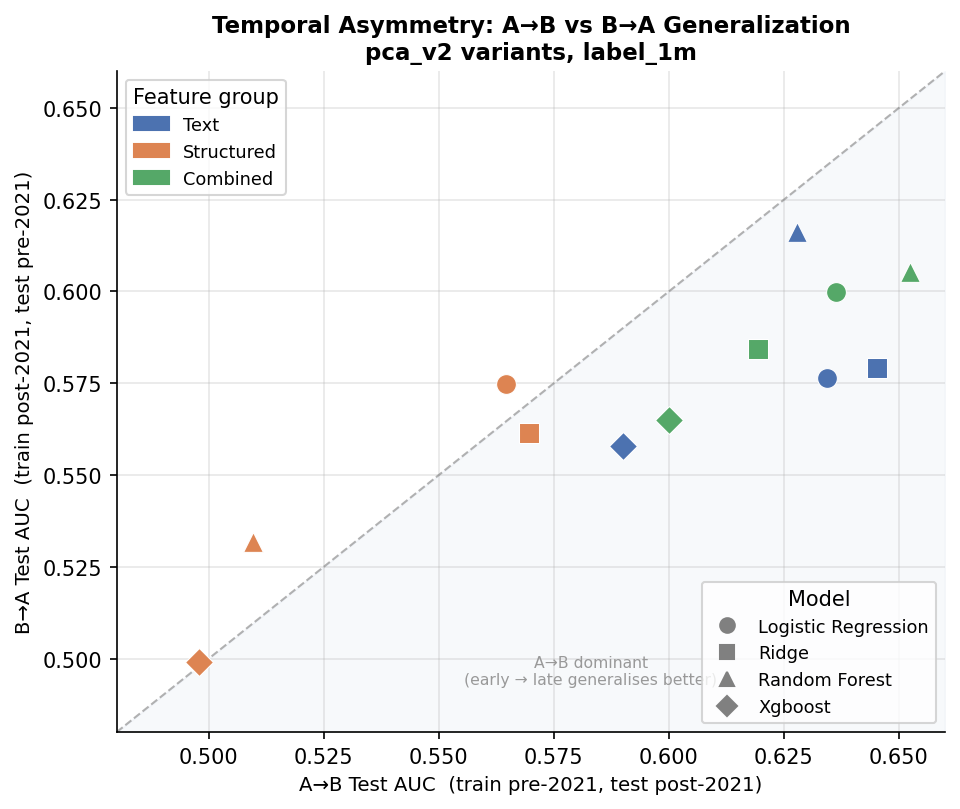
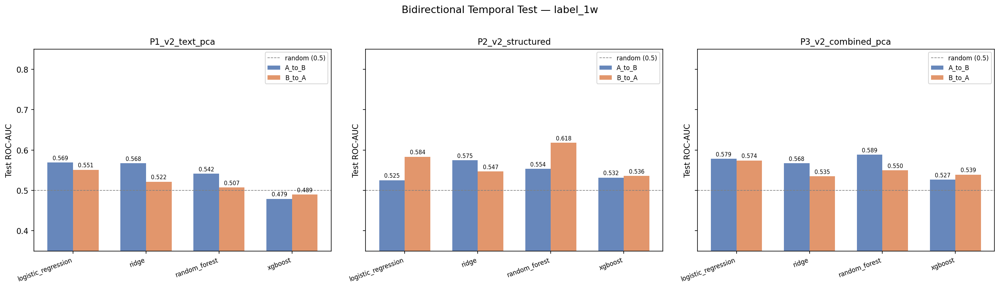
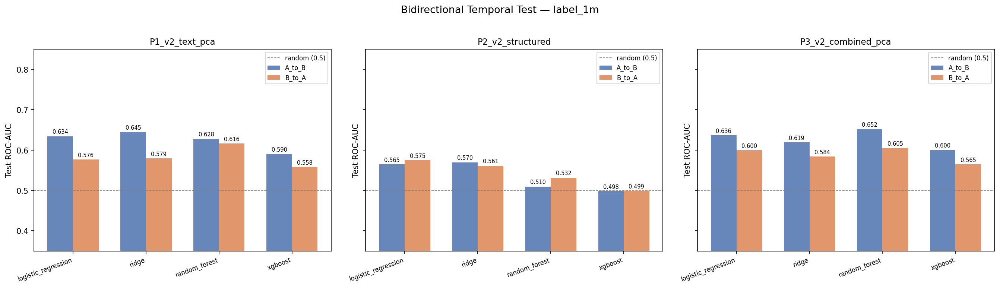
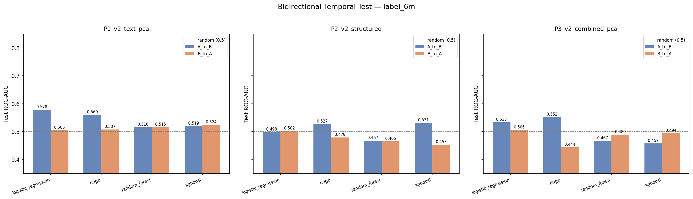
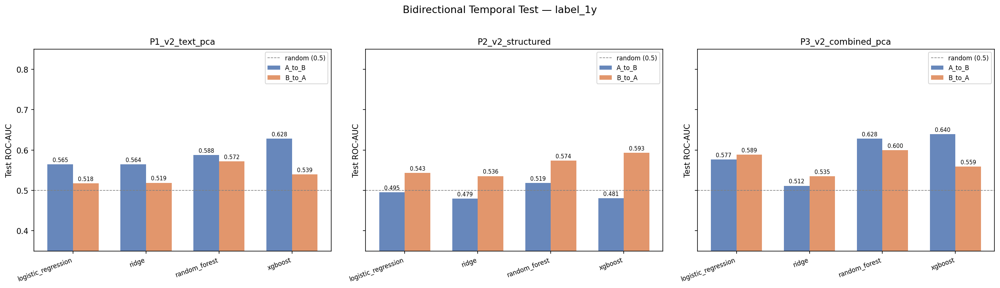

# IPO Analyzer

A research system that tests whether language in IPO filings (SEC S-1 / 424B4) predicts post-IPO stock performance, and whether text signal adds alpha over financial fundamentals.

---

## Overview

This project extracts features from SEC IPO filings and post-IPO return data to build predictive models for four return horizons: 1 week, 1 month, 6 months, and 1 year post-IPO. It is not primarily a production prediction system — it is a structured research investigation into the nature and limits of signal in noisy, small-sample financial data.

The central question: **does language in IPO filings predict aftermarket returns, and does it add information beyond financial metrics and market context?**

---
## Key Results (TL;DR)

- Best cross-validation performance: **0.75 AUC (1-year horizon)**
- Best temporal out-of-sample performance: **~0.61 AUC**
- Structured features (underwriter, proceeds, valuation) dominate prediction
- Text provides modest signal but generalizes better across time
- Models trained on one market regime fail to generalize to others
- Dimensionality reduction (PCA) improves robustness

## Why IPO Prediction Is Hard

IPO return prediction presents several compounding challenges that make this a genuinely difficult ML problem:

- **Small dataset**: ~500–700 IPOs across a 5-year window, of which only ~425 have complete text + structured features
- **Noisy labels**: binary return labels (above/below 0) at 1w/1m/6m/1y are noisy proxies for "quality"; short-term returns are especially random
- **Regime dependence**: IPO markets are highly episodic — the 2020/2021 boom period behaves fundamentally differently from 2018–2019 and 2022–2023, making models trained on one period unreliable on another
- **Class imbalance**: 6m and 1y targets have only 30–34% positive rate (stock above IPO price), creating a naive accuracy baseline of 66–70% that misleads raw accuracy metrics
- **Causal ambiguity**: high-quality filings may correlate with good companies, but good companies also write better filings; direction of causation is unclear

These constraints shaped every modeling decision throughout the project.

---

## Data & Pipeline

### Data Sources

| Source | Description |
|--------|-------------|
| SEC EDGAR | S-1 and 424B4 (final prospectus) filings for ~700 IPOs, 2018–2023 |
| stockanalysis.com | IPO universe, dates, exchange, sector |
| yfinance | Post-IPO price returns at 1w/1m/6m/1y |
| FRED / yfinance | VIX, S&P 500, sector ETF prices for market context |

### Pipeline

```
SEC EDGAR filings (HTML)
       ↓
Section extraction (Risk Factors, Business, Use of Proceeds, etc.)
       ↓
Text features (VADER sentiment, keyword densities, readability)
       ↓
Sentence-transformer embeddings → PCA compression (384 → 30 dims)
       ↓
Structured features (valuation multiples, market context, underwriter tier, proceeds classification)
       ↓
Regime normalization (z-score / percentile within rolling 360-day window)
       ↓
Model training (LR, Ridge, RF, XGBoost) with 5-fold stratified CV
       ↓
Evaluation (ROC-AUC, balanced accuracy, permutation tests, temporal split tests)
```

---

## Feature Engineering

### Text Features

Extracted from six named sections per filing: Business Description, Risk Factors, Use of Proceeds, MD&A, Financial Statements, and a general summary.

**Handcrafted NLP features (~30 features):**
- VADER sentiment scores (compound, positive, negative) applied to summary and business sections
- Keyword density features: uncertainty language, growth language, profitability language, loss/risk language
- Section structure features: total text length, risk section length, risk-to-total ratio, number of sections found
- Readability proxies derived from section length distributions

**Sentence-transformer embeddings:**
- Model: `all-MiniLM-L6-v2` — 384-dimensional dense embeddings per section
- Sections are weighted-averaged into a single filing-level embedding vector
- Cached to `.npz` to avoid recomputing across runs

**Limitation:** High-dimensional embeddings (384 features on 425 samples) cause severe overfitting. This was the primary motivation for PCA compression.

### Structured Features

**Financial multiples** (from filing HTML via BeautifulSoup + regex):
- Revenue, EBITDA, net income multiples at IPO price
- `proceeds_to_revenue_ratio` (where extractable)
- `insider_proceeds_pct` — fraction of offering from secondary (insider selling)

**Market context** (trailing/as-of IPO date, fully leakage-free):
- VIX level, S&P 500 trailing return
- Sector ETF trailing return
- IPO volume: `ipos_prior_30d`, `ipos_prior_90d` (strictly trailing count)

**Underwriter tier:**
- Lead underwriter extracted from filing text + raw HTML fallback
- Normalized via alias mapping, assigned to Tier 1 / 2 / 3
- Current identification rate: ~81% of IPOs

**Use-of-proceeds classification:**
- Keyword scoring of the Use of Proceeds section into: debt repayment, growth/R&D investment, general corporate, secondary sale
- Captures stated management intent at IPO time

### Regime-Aware Features

A core problem identified early: raw market context features (VIX, S&P returns, IPO volume) carry regime-level information that confounds cross-period generalization. A model trained during a low-VIX bull market learns absolute levels, not relative positioning.

Two normalization approaches were developed:
- **Calendar-year normalization** (`_year_z`, `_year_pctile`): z-score and percentile rank within the same calendar year. Computationally simple, but uses future information for grouping.
- **Rolling 360-day normalization** (`_roll360_z`, `_roll360_pctile`): z-score and percentile rank within a trailing 360-day window centered on IPO date. Fully leakage-free. Used in PCA v2.

Both methods exclude `ipo_year` itself from model features — it was identified as a primary temporal shortcut leakage vector (see below).

---

## Modeling Approach

### Models

Four model types were trained for every variant × target combination:

| Model | Notes |
|-------|-------|
| Logistic Regression | L2 regularization; good baseline for linear signal |
| Ridge Classifier | Stronger regularization than LR; most stable temporal generalizer |
| Random Forest | Captures non-linear interactions; prone to severe overfitting on small samples |
| XGBoost | Best in-sample performance at longer horizons; also overfits heavily on temporal splits |

All models use class balancing: `class_weight="balanced"` for LR/RF, `scale_pos_weight` for XGBoost.

### Hyperparameter Tuning

After identifying overfitting as the central problem, `RandomizedSearchCV` was applied (40 trials for tree models, 8 for linear) targeting shallower, more regularized configurations:

- **XGBoost**: `max_depth` 2–3 (vs default 6), `subsample` 0.6, `min_child_weight` 3
- **Random Forest**: `max_depth` 4–8, `min_samples_leaf` 5–20, `max_features` 0.3–0.5
- **Ridge**: `alpha` 50–100 (vs default 1.0) — dramatically stronger regularization
- **Logistic Regression**: `C` 0.005–0.01 — similarly aggressive

Tuned params are saved per-target to `tuned_params.json` and reused for retraining.

---

## Experiments & Iterations

### Version 1 — Baseline (M-series)

**Variants:** M1 (text only), M2 (structured only), M3 (combined)

First full run. Text-only (M1) immediately outperformed structured (M2) at 1w and 1m, suggesting language carries genuine signal at short horizons. M3 (combined) added only marginal lift over M1.

However, M2 and M3 showed strong performance at longer horizons (6m, 1y) that was later traced to `ipo_year` — the model was learning "2021 = positive return" rather than any genuine financial feature.

**label_1m results (best per variant):**

| Variant | Model | ROC-AUC |
|---------|-------|---------|
| M1 text | RF | 0.620 ± 0.019 |
| M2 structured | RF | 0.630 ± 0.062 |
| M3 combined | RF | 0.631 ± 0.025 |

**Issues fixed during this phase:**
- `ipos_same_month` (IPO volume feature) included future-month data → replaced with strictly-trailing `ipos_prior_30d` / `ipos_prior_90d`
- Initial run used only LR + XGB; RF and Ridge added in the second run, revealing RF as the consistently strongest baseline model



---

### Version 2 — Enhanced Features (E-series)

**Variants:** E1 (text + proceeds), E2 (structured + underwriter + proceeds + year-normalized), E3 (combined)  
**Experiment:** `enhanced_v2_no_ipoyear`

Added three new feature groups: underwriter tier, use-of-proceeds keyword scores, and year-relative normalized market/multiples features. Crucially, `ipo_year` (raw integer) was excluded from all E-series models — the first explicit leakage guard.

E2 structured improved meaningfully over M2 at label_1m (XGB 0.655 vs 0.607). E1 text showed little improvement over M1 — use-of-proceeds scores added minimal signal on top of existing text features.

**label_1m results:**

| Variant | Model | ROC-AUC |
|---------|-------|---------|
| E1 text enhanced | RF | 0.637 ± 0.026 |
| E2 structured enhanced | XGB | 0.655 ± 0.039 |
| E3 combined enhanced | RF | 0.631 ± 0.010 |

**Temporal generalization test (bidirectional, label_1m, avg both directions):**

| Variant | Best model | Avg test AUC |
|---------|-----------|-------------|
| E1 text | RF | 0.598 |
| E2 structured | RF | 0.542 |
| E3 combined | RF | 0.596 |

E2 structured shows regime asymmetry: A→B 0.556 vs B→A 0.502, revealing that structured features trained on the pre-2021 period don't transfer to the post-2021 correction. This was the first strong evidence that structured features were regime-memorizing, not generalizing.

---

### Version 3 — PCA Compression (PCA v1)

**Variants:** P1 (handcrafted NLP + 30 PCA embedding components + proceeds), P2 (=E2 structured), P3 (P1+P2)  
**Experiments:** `pca_v1`, `pca_v1_tuned`

The core insight driving this iteration: 384-dimensional sentence-transformer embeddings on 425 samples is a severe overfitting setup. Compressing to 30 PCA components (~70.7% explained variance) forces the model to use only the dominant linear structure in the embedding space.

**Effect on text temporal generalization (label_1m, avg both directions):**

| | E1 (raw embeddings) | P1 (PCA 30 dims) |
|--|--|--|
| Ridge avg test AUC | 0.534 | **0.620** |
| RF avg test AUC | 0.598 | 0.614 |

PCA compression improved Ridge temporal generalization by +0.086. The train→test AUC drop fell from ~0.26 to ~0.21 for linear models.

After hyperparameter tuning across all 4 targets:

| Target | Best variant/model | CV AUC |
|--------|-------------------|--------|
| label_1w | P2 RF | 0.643 |
| label_1m | P3 LR/RF | 0.669 |
| label_6m | P2 RF | 0.660 |
| label_1y | P3 XGB | **0.731** |

**Key finding from this phase:** Tree models (RF, XGB) still massively overfit on temporal splits even with PCA (drops of 0.37–0.44). **Linear models (LR, Ridge) are the only reliable temporal generalizers.** The signal appears to live in linear combinations of features, not nonlinear interactions.



---

### Version 4 — Regime-Unaware Rolling Normalization (PCA v2)

**Variants:** P1_v2, P2_v2, P3_v2  
**Experiments:** `pca_v2` (tuning), `pca_v2_tuned_regime_unaware`

Three additional changes motivated this version:

1. **Rolling 360-day normalization** replaces calendar-year normalization for market and multiples features. Calendar-year grouping uses the year as an implicit regime proxy. Rolling windows normalize each IPO relative to the 360 days preceding it — fully leakage-free.

2. **`is_hot_ipo_year` excluded** — a binary flag encoding 2020/2021 directly as a regime label. Even after removing `ipo_year`, this feature was a direct regime shortcut.

3. **`total_proceeds_m` excluded** — set to a placeholder value of $100M for most IPOs (real data unavailable). Drops from removing it were small (≤0.02 AUC), confirming it wasn't carrying genuine signal.

**Final CV results across all 4 targets:**

| Target | Variant | Model | CV AUC | Bal Acc |
|--------|---------|-------|--------|---------|
| label_1w | P2_v2 RF | | 0.637 | 0.600 |
| label_1w | P3_v2 LR | | 0.616 | 0.600 |
| label_1m | P3_v2 LR | | 0.668 | 0.626 |
| label_1m | P2_v2 RF | | 0.653 | 0.605 |
| label_6m | P3_v2 RF | | 0.674 | 0.643 |
| label_6m | P2_v2 RF | | 0.675 | 0.625 |
| label_1y | **P3_v2 XGB** | | **0.756** | **0.691** |
| label_1y | P3_v2 RF | | 0.737 | 0.666 |

**Permutation test results (20 shuffles, null AUC ~0.50):**
- label_1m: 12/12 models SIGNAL (p=0.000)
- label_1y: 12/12 models SIGNAL (p=0.000)
- label_6m: 10/12 SIGNAL, 2 MARGINAL
- label_1w: 8/12 SIGNAL, 3 MARGINAL, 1 NO SIGNAL (P3 Ridge)

No leakage detected in any variant.




### Logistic Regression Coefficients (pca_v2_tuned, label_1m)

The plots below show the top 15 positive and negative weights for each variant's logistic regression model. Coefficients are in the standardised feature space — larger absolute values mean stronger influence per standard deviation of that feature.



---

---

## Evaluation Methodology

Rigorous evaluation was treated as a first-class concern throughout, using three complementary approaches.

### 1. Cross-Validation (CV AUC / Balanced Accuracy)

All reported CV numbers use **5-fold stratified cross-validation** with shuffling. Metrics:
- **ROC-AUC**: primary metric; 0.5 = random, 1.0 = perfect. Reported with standard deviation across folds.
- **Balanced accuracy**: accounts for class imbalance; important for 6m/1y targets where naive accuracy baseline is 66–70%.
- Raw accuracy is deliberately not reported as a primary metric.

### 2. Permutation Tests (Leakage Detection)

For every experiment family, 20 independent random permutations of the labels are run through the full training pipeline. If features carry post-IPO information (leakage), AUC will remain elevated even on shuffled labels.

**Interpretation:**
- Clean: Real AUC >> null mean (~0.50); p < 0.05
- Leakage signal: Null AUC >> 0.50

### 3. Bidirectional Temporal Split Tests

The IPO universe is sorted chronologically and split 50/50. Models are trained in **both directions** (early → late and late → early). A one-directional split might yield good results simply because later patterns happen to match training patterns. Testing both directions reveals whether signal is genuinely regime-independent.

Split boundary: 2021-06-24 (258 earlier / 259 later IPOs).



**Bidirectional AUC comparison — by target:**






---

## Results

### Cross-Validation AUC by Horizon

Best results from the final experiment (`pca_v2_tuned_regime_unaware`):

| Horizon | Best variant | Model | CV AUC | Dominant feature group |
|---------|-------------|-------|--------|----------------------|
| 1 week | P2_v2 RF | | 0.637 | Structured |
| 1 month | P3_v2 LR | | 0.668 | Combined |
| 6 months | P3_v2 RF | | 0.675 | Combined / Structured |
| 1 year | P3_v2 XGB | | **0.756** | Combined |

Signal strengthens monotonically with horizon. Longer-horizon returns are more fundamentals-driven and less sensitive to short-term market noise.

### Feature Group Comparison (label_1m)

| Group | Best CV AUC | Best temporal test AUC |
|-------|------------|----------------------|
| Text only (P1_v2) | 0.613 | **0.622** |
| Structured only (P2_v2) | 0.653 | 0.521 |
| Combined (P3_v2) | 0.668 | 0.629 |

Text features underperform structured in-sample but generalize substantially better across time periods.

### Temporal Generalization Summary (label_1m, bidirectional avg)

| Variant | Model | Avg test AUC | Train AUC | Drop |
|---------|-------|-------------|-----------|------|
| P1_v2 text | Ridge | 0.612 | 0.826 | +0.214 |
| P1_v2 text | LR | 0.605 | 0.814 | +0.209 |
| P3_v2 combined | LR | 0.618 | 0.905 | +0.286 |
| P2_v2 structured | RF | 0.521 | 0.951 | +0.430 |
| P2_v2 structured | XGB | 0.499 | 0.997 | **+0.498** |

P2 structured XGB is essentially random on the temporal holdout despite near-perfect train AUC.

---

## Key Findings


### 1. Signal Is Real but Moderate

IPO filings contain genuine predictive signal for aftermarket returns. Permutation tests confirm this across all horizons with null AUC consistently ~0.50 and real AUC beating null at p<0.05 for virtually all models at label_1m/6m/1y. The signal sits in the 0.60–0.76 AUC range — above random, below actionable without substantially more data.

### 2. Temporal Leakage Was the Central Problem

The most consequential finding was that **`ipo_year` (raw integer) acted as a temporal shortcut**. Models trained with it learned that IPOs in 2020/2021 tended to perform well, without learning any genuine filing-level signal. This inflated baseline M2/M3 results, particularly at 6m/1y. Removing `ipo_year` and `is_hot_ipo_year` was necessary before any honest evaluation of real signal.

### 3. Text Generalizes Better Than Structured Features

Text features hold up much better across market regimes. Structured features — VIX levels, S&P returns, valuation multiples — are inherently regime-sensitive. A model learning "low VIX + rising S&P = good IPO" learns a regime correlation, not a firm-level signal. This is the root cause of P2's bidirectional temporal collapse.

### 4. Overfitting Is the Primary Modeling Bottleneck

With ~425 samples and up to 117 features, all nonlinear models memorize training data. Train AUC is routinely 0.95–1.00 while test AUC is 0.50–0.63 in temporal splits. Two interventions helped: PCA compression (384 → 30 dims, reduces linear model drops ~0.05) and hyperparameter constraints (shallower trees, higher regularization, reduces XGB drops from +0.42 to +0.30). Even so, tree models remain unreliable temporal generalizers — **use linear models for any out-of-sample evaluation**.

### 5. Combined Features Are Best In-Sample; Text Alone Is Most Robust Out-of-Sample

P3 combined variants consistently produce the highest CV AUC. But in temporal splits, P1 text often matches or beats P3 combined, because structured features add variance alongside signal. The optimal choice depends on whether the deployment period resembles the training period.

### 6. Signal Grows with Horizon

The 1-year horizon shows the strongest and most consistent signal (best CV AUC 0.756, best temporal test AUC 0.614). Short-term IPO returns are heavily noise-driven; longer-term performance is more tied to underlying business quality that filings partially encode.

---

## Regime Dependence & Generalization

Regime dependence was the most persistent challenge in the project. The IPO market of 2020/2021 was historically anomalous: record issuance, compressed multiples, high first-day pops, and broadly positive aftermarket performance. Any model trained primarily on this period learns a regime signal, not a firm-level signal.

**Quantifying the asymmetry:** In bidirectional temporal tests (split boundary: 2021-06-24), the A→B direction (train pre-2021, test post-2021) consistently outperforms B→A by ~0.04–0.06 AUC. The post-2021 correction period contains more variation in IPO outcomes, making it a richer training set that partially generalizes backward — but the reverse does not hold.

**What rolling normalization fixed:** Removing absolute level effects from market features reduced some of the regime confounding at the feature level. Regime-normalized features prevent the model from directly learning "high absolute VIX = bad" and instead learn relative positioning.

**What rolling normalization didn't fix:** P2_v2 structured still collapses in temporal splits (avg test AUC 0.521 at label_1m), only marginally better than pca_v1's P2 (0.542). Normalization helps at the margin but cannot address the fundamental issue: the relationship between market conditions and IPO returns is non-stationary. The same VIX level means different things in different macro environments.

**Practical implication:** For any deployment, text-based linear models are the only configuration that demonstrates meaningful regime robustness. Combined or structured-only models should only be used when the deployment period is well-represented in the training data.

---

## Limitations

- **Small dataset (~425–517 samples)**: The primary bottleneck. Most findings have high variance (CV std 0.04–0.10). The directional conclusions are likely correct, but precise AUC estimates are unreliable.
- **Binary labels are noisy proxies**: "Return > 0 at 1 month" is a weak signal for IPO quality. Return magnitude, risk-adjusted return, or peer-relative return would be more informative targets.
- **Shallow text representation**: VADER and keyword features capture surface-level sentiment, not semantic content. `all-MiniLM-L6-v2` embeddings are better, but PCA compression discards ~30% of their variance and no domain fine-tuning was applied.
- **Sparse financial data**: Most IPOs have only `total_proceeds_m = $100M` (placeholder); many multiples fields are NaN from failed HTML extraction. The structured feature set is more complete in theory than in practice.
- **No causal inference**: Correlation between filing language and returns likely reflects underlying company quality rather than a causal language effect. Companies with strong fundamentals write more confident filings AND perform better.
- **Regime sensitivity remains unsolved**: Despite multiple normalization approaches, models remain unreliable across market regimes. This appears to be a fundamental limitation of the current feature set.

---

## Future Work

- **Better text representations**: Fine-tuned domain-specific transformers (e.g., FinBERT, or a model fine-tuned on prospectus language) could capture semantic content that generic sentence embeddings miss. Passage-level retrieval rather than document-level averaging would improve resolution.
- **Larger dataset**: The single highest-leverage improvement. Extending to 10 years of IPOs (~1,500–2,000 samples) would dramatically reduce variance and enable robust regime-split evaluation.
- **Regression target**: Binary "return > 0" discards magnitude. Predicting return percentile or return decile within a cohort would reduce label noise and be more actionable.
- **Regime-conditioned models**: Rather than normalizing away regime effects, explicitly condition on them — train separate models per regime cluster, or use a latent regime variable as a conditioning input.
- **IPO type segmentation**: Tech vs healthcare vs consumer IPOs operate under different valuation regimes. Separate models per sector could reduce within-variant noise.
- **Macro signal integration**: Yield curve slope, credit spreads, and institutional sentiment could add regime context beyond the current VIX/S&P proxies.
- **Causal framing**: A difference-in-differences design comparing similar companies that chose different language would help isolate a language effect from underlying quality confounds.

---

## Repository Structure

```
src/
  ingestion/              # SEC EDGAR + yfinance data collection
  parsing/                # HTML → named section JSON extraction
  features/               # Feature engineering (text, multiples, embeddings, regime)
  modeling/               # Training, evaluation, tuning, and test scripts
  modeling-test-leakage/  # Permutation and temporal split leakage tests

data/
  raw/                    # EDGAR HTML filings, IPO list overrides
  processed/              # Feature CSVs, trained models, evaluation outputs
    experiments/          # Versioned experiment dirs (enhanced, pca_v1, pca_v2, ...)
    leakage-test-results/ # Permutation test JSONs
  cache/                  # Embedding NPZ cache, price cache

results/
  temporal_bidirectional/ # Bidirectional temporal split CSVs and plots

config/
  settings.py             # All paths, constants, keyword lists

results_tracker.md        # Auto-appended run history
CLAUDE.md                 # Experiment design reference and pipeline commands
```

### Key Scripts

| Script | Purpose |
|--------|---------|
| `src/features/regime_normalized.py` | Calendar-year or rolling 360d regime normalization |
| `src/features/pca_embeddings.py` | 384→N PCA compression of sentence-transformer embeddings |
| `src/modeling/train_experiment.py` | Versioned experiment training (E/P series) |
| `src/modeling/tune_hyperparams.py` | RandomizedSearchCV across all variants and targets |
| `src/modeling/temporal_bidirectional_test.py` | Bidirectional temporal generalization test |
| `src/modeling-test-leakage/permutation_test.py` | Label permutation leakage test |
| `src/modeling/compare_experiments.py` | Delta-AUC comparison across experiment versions |

---

## Quick Start

```bash
# Environment
source .venv/bin/activate
pip install -r requirements.txt
pip install sentence-transformers

# Train latest experiment (pca_v2, all targets)
python src/modeling/train_experiment.py \
    --experiment pca_v2_tuned_regime_unaware \
    --variants pca_v2 \
    --hyperparams data/processed/experiments/pca_v2/tuned_params.json \
    --notes "description of run"

# Validate: no leakage
python src/modeling-test-leakage/permutation_test.py \
    --variants pca_v2 --target label_1m --shuffles 20

# Validate: temporal generalization
python src/modeling/temporal_bidirectional_test.py \
    --variants pca_v2 --target label_1m

# Interactive results explorer
streamlit run app/streamlit_app.py
```

See `CLAUDE.md` for the full pipeline including data collection and all experiment commands.

---

## Summary

IPO filings contain genuine but weak predictive signal for aftermarket returns, with signal strengthening considerably at longer horizons (1-year best CV AUC: 0.756). The most important finding is methodological: **regime leakage is pervasive in financial ML**. Careful permutation testing and bidirectional temporal evaluation are essential to distinguish genuine signal from regime memorization. The persistent gap between in-sample performance (AUC ~0.75) and temporal out-of-sample performance (AUC ~0.61) reflects this challenge. Closing it likely requires more data and explicitly regime-conditioned models rather than additional feature engineering.
