# IPO Language & Aftermarket Performance — Evaluation Report

**Cross-validation:** 5-fold stratified  

---

## Target: `label_1w`

Naive accuracy baseline: **52.2%**

| Variant | Model | ROC-AUC | ± | Bal-Accuracy | ± | Pred +% | N |
|---------|-------|---------|---|-------------|---|---------|---|
| M1_text | logistic_regression | 0.516 | 0.032 | 0.511 | 0.030 | 52.9% | 425 |
| M1_text | ridge | 0.530 | 0.037 | 0.529 | 0.053 | 55.8% | 425 |
| M1_text | random_forest | 0.607 | 0.054 | 0.601 | 0.059 | 56.9% | 425 |
| M1_text | xgboost | 0.586 | 0.033 | 0.573 | 0.038 | 57.4% | 425 |
| M2_multiples | logistic_regression | 0.592 | 0.045 | 0.575 | 0.028 | 57.6% | 517 |
| M2_multiples | ridge | 0.596 | 0.057 | 0.565 | 0.059 | 49.9% | 517 |
| M2_multiples | random_forest | 0.608 | 0.077 | 0.578 | 0.065 | 54.5% | 517 |
| M2_multiples | xgboost | 0.584 | 0.053 | 0.555 | 0.059 | 53.8% | 517 |
| M3_combined | logistic_regression | 0.510 | 0.030 | 0.503 | 0.027 | 55.1% | 425 |
| M3_combined | ridge | 0.513 | 0.060 | 0.521 | 0.042 | 52.5% | 425 |
| M3_combined | random_forest | 0.594 | 0.055 | 0.585 | 0.064 | 56.7% | 425 |
| M3_combined | xgboost | 0.585 | 0.063 | 0.564 | 0.061 | 55.5% | 425 |

### Top Features

### M1_text

**logistic_regression** — top 10 features:

| Rank | Feature | Importance |
|------|---------|------------|
| 1 | `emb_089` | 0.4352 |
| 2 | `emb_026` | 0.3624 |
| 3 | `emb_187` | 0.3601 |
| 4 | `emb_104` | 0.3584 |
| 5 | `emb_315` | 0.3144 |
| 6 | `emb_076` | 0.3068 |
| 7 | `emb_108` | 0.3059 |
| 8 | `emb_225` | 0.2993 |
| 9 | `emb_094` | 0.2978 |
| 10 | `loss_keyword_density` | 0.2957 |

**ridge** — top 10 features:

| Rank | Feature | Importance |
|------|---------|------------|
| 1 | `emb_378` | 0.8397 |
| 2 | `emb_383` | 0.8207 |
| 3 | `emb_071` | 0.7431 |
| 4 | `emb_250` | 0.7199 |
| 5 | `emb_076` | 0.7167 |
| 6 | `emb_262` | 0.7140 |
| 7 | `emb_369` | 0.6936 |
| 8 | `emb_304` | 0.6148 |
| 9 | `emb_011` | 0.5981 |
| 10 | `emb_217` | 0.5887 |

**random_forest** — top 10 features:

| Rank | Feature | Importance |
|------|---------|------------|
| 1 | `emb_189` | 0.0132 |
| 2 | `emb_302` | 0.0104 |
| 3 | `emb_009` | 0.0101 |
| 4 | `emb_379` | 0.0094 |
| 5 | `emb_177` | 0.0092 |
| 6 | `emb_200` | 0.0087 |
| 7 | `emb_102` | 0.0082 |
| 8 | `emb_158` | 0.0073 |
| 9 | `emb_355` | 0.0073 |
| 10 | `emb_256` | 0.0068 |

**xgboost** — top 10 features:

| Rank | Feature | Importance |
|------|---------|------------|
| 1 | `emb_189` | 0.0113 |
| 2 | `emb_247` | 0.0097 |
| 3 | `emb_324` | 0.0097 |
| 4 | `emb_141` | 0.0086 |
| 5 | `emb_187` | 0.0086 |
| 6 | `emb_123` | 0.0085 |
| 7 | `emb_010` | 0.0083 |
| 8 | `emb_302` | 0.0083 |
| 9 | `emb_094` | 0.0082 |
| 10 | `emb_231` | 0.0081 |

### M2_multiples

**logistic_regression** — top 10 features:

| Rank | Feature | Importance |
|------|---------|------------|
| 1 | `ipo_year` | 0.4252 |
| 2 | `is_hot_ipo_year` | 0.3742 |
| 3 | `vix_30d_avg` | 0.2257 |
| 4 | `cash_burn_proxy` | 0.1887 |
| 5 | `total_assets` | 0.1875 |
| 6 | `price_range_revised_up` | 0.1788 |
| 7 | `sector_etf_ret_90d` | 0.1772 |
| 8 | `ipos_prior_30d` | 0.1570 |
| 9 | `revenue_prior` | 0.1512 |
| 10 | `has_insider_selling` | 0.1488 |

**ridge** — top 10 features:

| Rank | Feature | Importance |
|------|---------|------------|
| 1 | `is_hot_ipo_year` | 0.2171 |
| 2 | `ipo_year` | 0.2108 |
| 3 | `cash` | 0.1888 |
| 4 | `vix_30d_avg` | 0.1770 |
| 5 | `net_income` | 0.1482 |
| 6 | `vix_on_ipo_date` | 0.1263 |
| 7 | `sector_etf_ret_90d` | 0.1093 |
| 8 | `ipos_prior_30d` | 0.1060 |
| 9 | `price_range_revised_up` | 0.0796 |
| 10 | `has_insider_selling` | 0.0726 |

**random_forest** — top 10 features:

| Rank | Feature | Importance |
|------|---------|------------|
| 1 | `ipo_year` | 0.1152 |
| 2 | `sector_etf_ret_30d` | 0.0934 |
| 3 | `sp500_ret_30d` | 0.0896 |
| 4 | `ipos_prior_90d` | 0.0805 |
| 5 | `sector_etf_ret_90d` | 0.0738 |
| 6 | `vix_30d_avg` | 0.0722 |
| 7 | `ipos_prior_30d` | 0.0698 |
| 8 | `sector_vs_sp500_30d` | 0.0679 |
| 9 | `vix_on_ipo_date` | 0.0671 |
| 10 | `sp500_ret_90d` | 0.0649 |

**xgboost** — top 10 features:

| Rank | Feature | Importance |
|------|---------|------------|
| 1 | `ipo_year` | 0.1510 |
| 2 | `has_insider_selling` | 0.0782 |
| 3 | `total_proceeds_m` | 0.0565 |
| 4 | `sector_etf_ret_30d` | 0.0477 |
| 5 | `sp500_ret_90d` | 0.0452 |
| 6 | `cash` | 0.0447 |
| 7 | `cash_burn_proxy` | 0.0442 |
| 8 | `vix_30d_avg` | 0.0416 |
| 9 | `vix_on_ipo_date` | 0.0404 |
| 10 | `insider_proceeds_pct` | 0.0391 |

### M3_combined

**logistic_regression** — top 10 features:

| Rank | Feature | Importance |
|------|---------|------------|
| 1 | `emb_089` | 0.4225 |
| 2 | `emb_026` | 0.3925 |
| 3 | `emb_104` | 0.3604 |
| 4 | `emb_187` | 0.3594 |
| 5 | `is_hot_ipo_year` | 0.3144 |
| 6 | `loss_keyword_density` | 0.3113 |
| 7 | `emb_147` | 0.2978 |
| 8 | `emb_315` | 0.2885 |
| 9 | `emb_076` | 0.2820 |
| 10 | `emb_225` | 0.2809 |

**ridge** — top 10 features:

| Rank | Feature | Importance |
|------|---------|------------|
| 1 | `emb_383` | 0.8915 |
| 2 | `emb_071` | 0.8775 |
| 3 | `emb_250` | 0.8218 |
| 4 | `emb_136` | 0.7863 |
| 5 | `emb_378` | 0.7663 |
| 6 | `emb_317` | 0.6584 |
| 7 | `emb_262` | 0.6301 |
| 8 | `emb_175` | 0.6158 |
| 9 | `emb_076` | 0.6144 |
| 10 | `emb_181` | 0.5897 |

**random_forest** — top 10 features:

| Rank | Feature | Importance |
|------|---------|------------|
| 1 | `emb_189` | 0.0175 |
| 2 | `emb_200` | 0.0134 |
| 3 | `emb_302` | 0.0104 |
| 4 | `emb_158` | 0.0090 |
| 5 | `emb_064` | 0.0084 |
| 6 | `emb_256` | 0.0083 |
| 7 | `emb_061` | 0.0077 |
| 8 | `emb_080` | 0.0073 |
| 9 | `emb_006` | 0.0072 |
| 10 | `emb_288` | 0.0068 |

**xgboost** — top 10 features:

| Rank | Feature | Importance |
|------|---------|------------|
| 1 | `emb_189` | 0.0118 |
| 2 | `emb_010` | 0.0103 |
| 3 | `vix_30d_avg` | 0.0101 |
| 4 | `emb_247` | 0.0099 |
| 5 | `emb_358` | 0.0096 |
| 6 | `emb_224` | 0.0092 |
| 7 | `emb_335` | 0.0090 |
| 8 | `emb_094` | 0.0089 |
| 9 | `emb_187` | 0.0086 |
| 10 | `emb_171` | 0.0082 |

### Signal Interpretation

**xgboost:**

- M1 (text only): ROC-AUC = 0.586
- M2 (fundamentals only): ROC-AUC = 0.584
- M3 (combined): ROC-AUC = 0.585

**Mixed result:** Text adds marginal lift (+0.001 AUC). With a larger corpus the signal may become clearer.
Best variant achieves 0.586 AUC — modest lift above random. Consider expanding the IPO universe for stronger signal.

**logistic_regression:**

- M1 (text only): ROC-AUC = 0.516
- M2 (fundamentals only): ROC-AUC = 0.592
- M3 (combined): ROC-AUC = 0.510

**Text does not help:** M3 underperforms M2 by 0.081 AUC, suggesting text may be adding noise or overfitting with this sample size.
Best variant achieves 0.592 AUC — modest lift above random. Consider expanding the IPO universe for stronger signal.

### Notable Findings

- **`emb_089`** is the #1 feature in **M1_text/logistic_regression** (importance: 0.4352)
- **`emb_378`** is the #1 feature in **M1_text/ridge** (importance: 0.8397)
- **`emb_189`** is the #1 feature in **M1_text/random_forest** (importance: 0.0132)
- **`ipo_year`** is the #1 feature in **M2_multiples/logistic_regression** (importance: 0.4252)
- **`is_hot_ipo_year`** is the #1 feature in **M2_multiples/ridge** (importance: 0.2171)
- **`emb_383`** is the #1 feature in **M3_combined/ridge** (importance: 0.8915)

### SHAP Plots

**M1_text/logistic_regression**

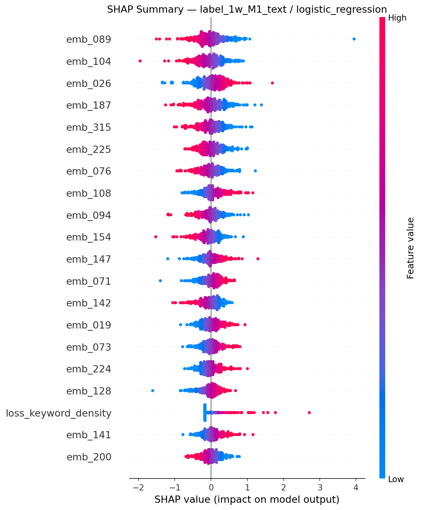

**M1_text/ridge**

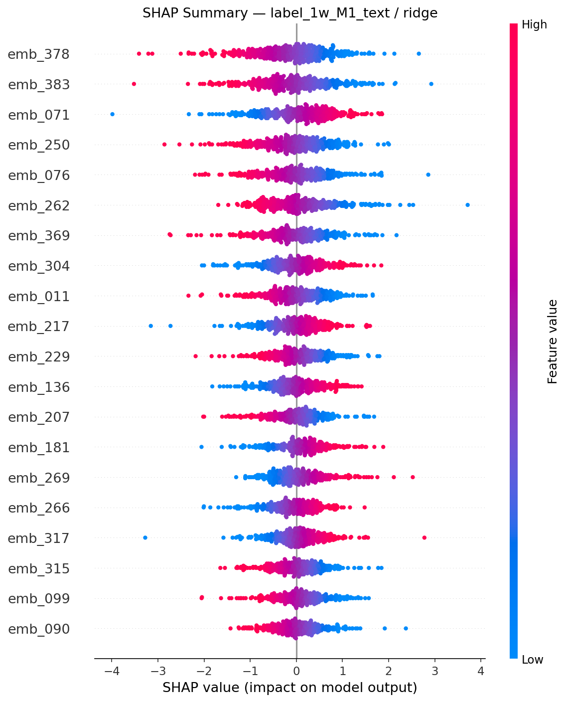

**M1_text/random_forest**

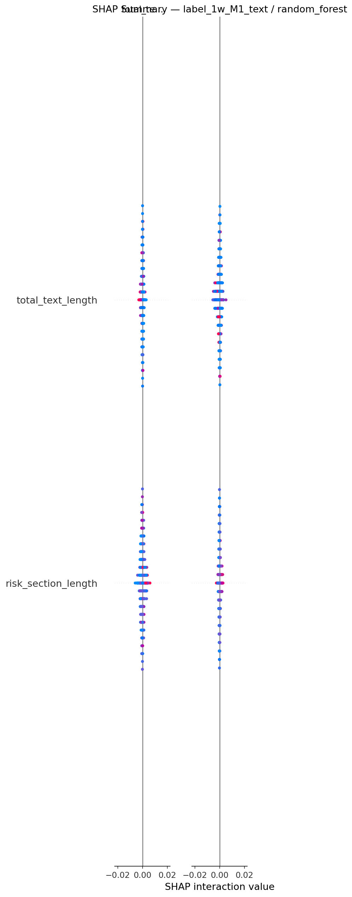

**M1_text/xgboost**

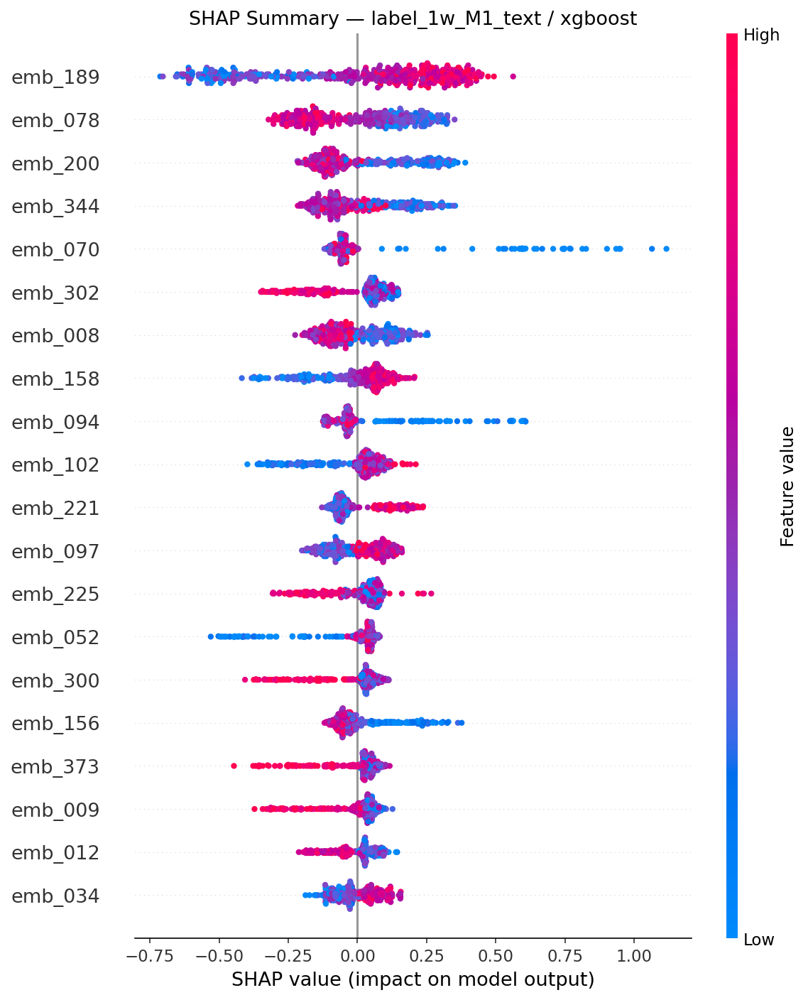

**M2_multiples/logistic_regression**

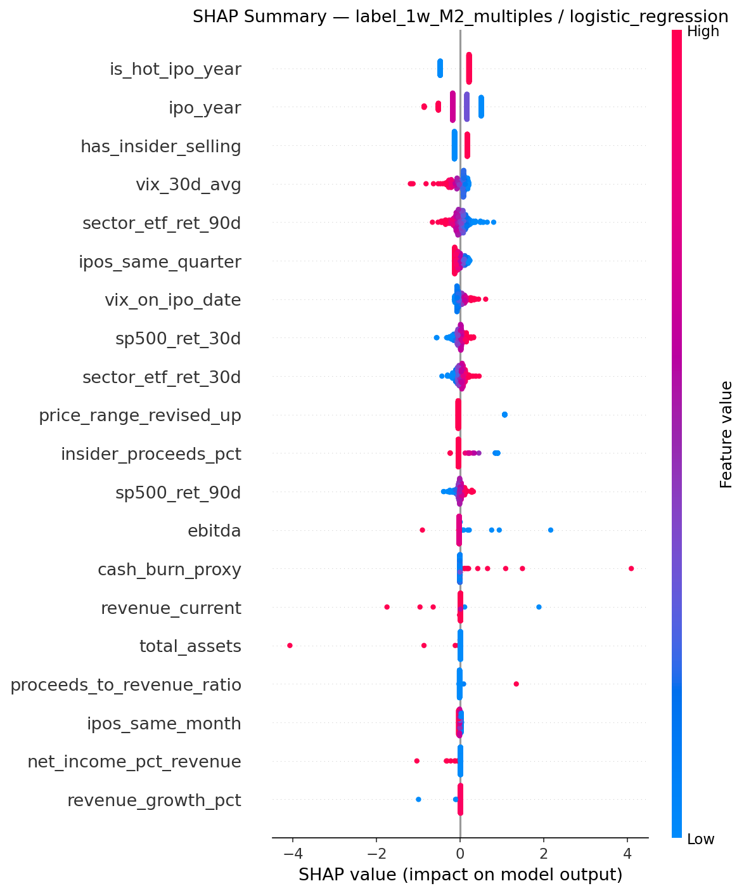

**M2_multiples/ridge**

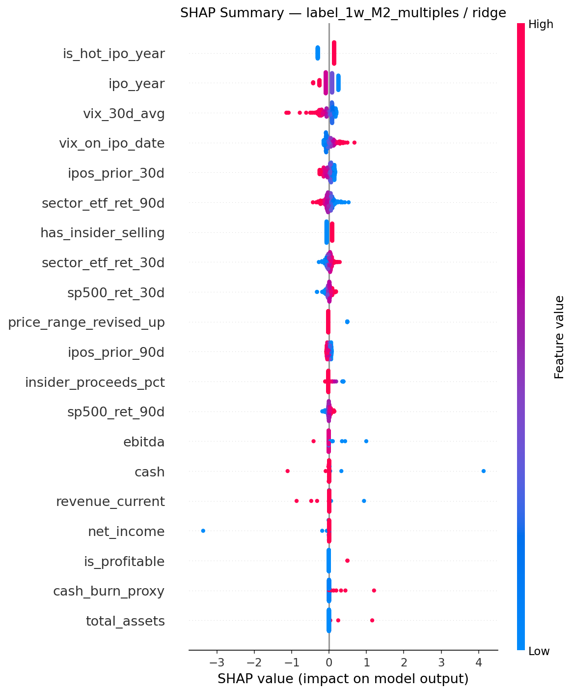

**M2_multiples/random_forest**

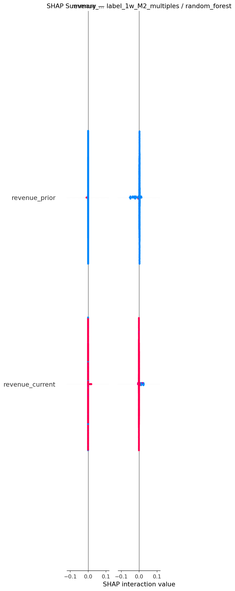

**M2_multiples/xgboost**

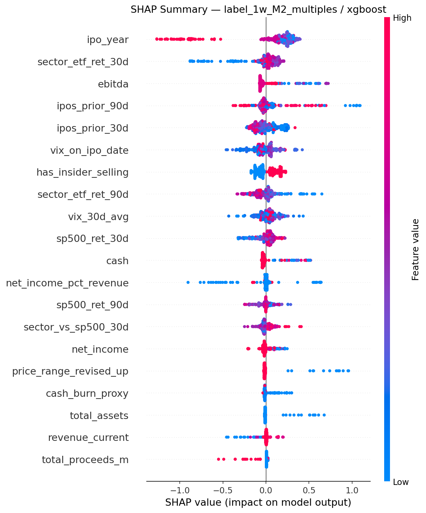

**M3_combined/logistic_regression**

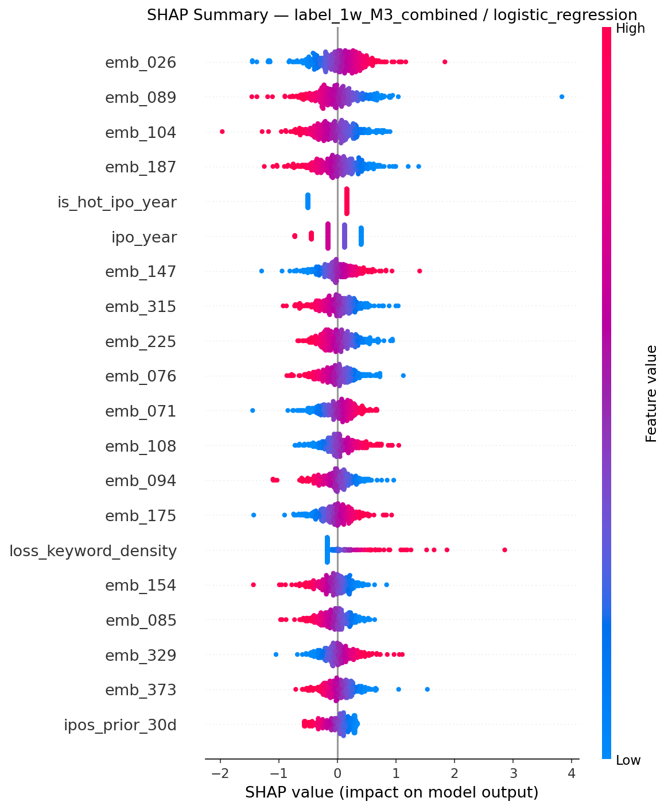

**M3_combined/ridge**

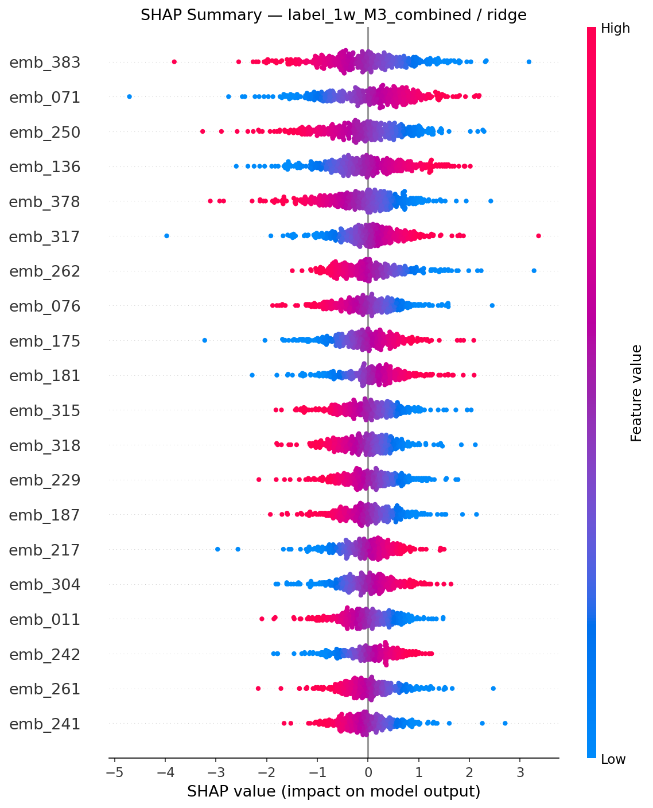

**M3_combined/random_forest**

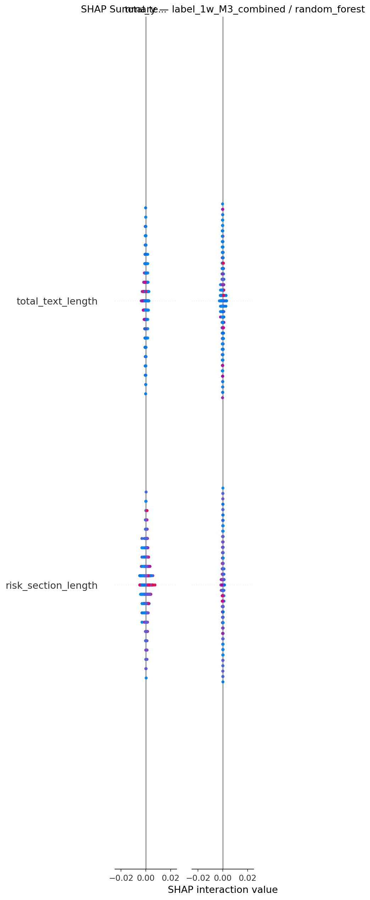

**M3_combined/xgboost**

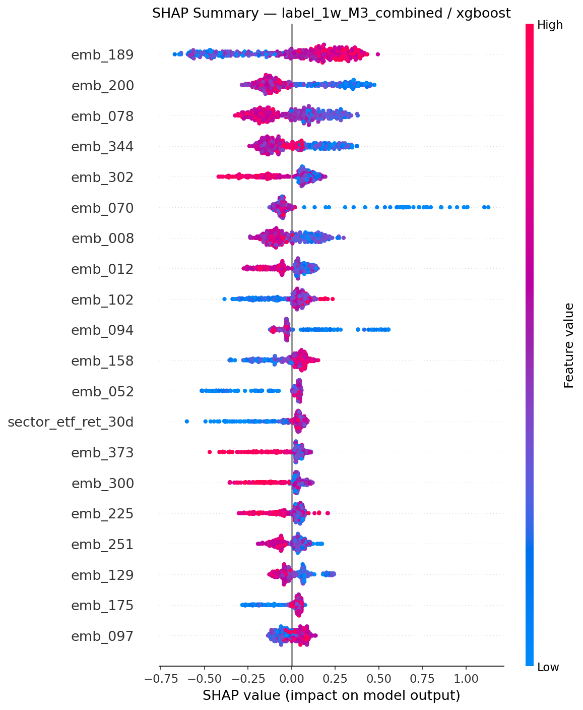

---

## Target: `label_1m`

Naive accuracy baseline: **50.6%**

| Variant | Model | ROC-AUC | ± | Bal-Accuracy | ± | Pred +% | N |
|---------|-------|---------|---|-------------|---|---------|---|
| M1_text | logistic_regression | 0.612 | 0.029 | 0.581 | 0.044 | 52.2% | 425 |
| M1_text | ridge | 0.583 | 0.052 | 0.558 | 0.050 | 49.9% | 425 |
| M1_text | random_forest | 0.620 | 0.019 | 0.612 | 0.032 | 54.4% | 425 |
| M1_text | xgboost | 0.607 | 0.035 | 0.577 | 0.042 | 56.0% | 425 |
| M2_multiples | logistic_regression | 0.566 | 0.062 | 0.549 | 0.053 | 52.6% | 517 |
| M2_multiples | ridge | 0.553 | 0.065 | 0.532 | 0.055 | 45.1% | 517 |
| M2_multiples | random_forest | 0.630 | 0.062 | 0.577 | 0.050 | 46.4% | 517 |
| M2_multiples | xgboost | 0.607 | 0.071 | 0.571 | 0.060 | 47.0% | 517 |
| M3_combined | logistic_regression | 0.619 | 0.038 | 0.584 | 0.042 | 52.5% | 425 |
| M3_combined | ridge | 0.587 | 0.056 | 0.567 | 0.044 | 50.4% | 425 |
| M3_combined | random_forest | 0.631 | 0.025 | 0.612 | 0.036 | 53.9% | 425 |
| M3_combined | xgboost | 0.615 | 0.037 | 0.600 | 0.040 | 53.2% | 425 |

### Top Features

### M1_text

**logistic_regression** — top 10 features:

| Rank | Feature | Importance |
|------|---------|------------|
| 1 | `emb_315` | 0.4775 |
| 2 | `emb_380` | 0.3421 |
| 3 | `emb_120` | 0.3367 |
| 4 | `emb_076` | 0.3354 |
| 5 | `emb_329` | 0.3271 |
| 6 | `emb_369` | 0.3184 |
| 7 | `emb_153` | 0.3177 |
| 8 | `emb_256` | 0.3085 |
| 9 | `emb_383` | 0.3015 |
| 10 | `emb_047` | 0.2944 |

**ridge** — top 10 features:

| Rank | Feature | Importance |
|------|---------|------------|
| 1 | `emb_232` | 0.8086 |
| 2 | `emb_383` | 0.8021 |
| 3 | `emb_378` | 0.7184 |
| 4 | `emb_367` | 0.6763 |
| 5 | `emb_356` | 0.6167 |
| 6 | `emb_380` | 0.6092 |
| 7 | `emb_250` | 0.6016 |
| 8 | `emb_152` | 0.5898 |
| 9 | `emb_233` | 0.5862 |
| 10 | `emb_005` | 0.5801 |

**random_forest** — top 10 features:

| Rank | Feature | Importance |
|------|---------|------------|
| 1 | `emb_006` | 0.0116 |
| 2 | `emb_149` | 0.0112 |
| 3 | `emb_200` | 0.0112 |
| 4 | `emb_064` | 0.0096 |
| 5 | `emb_189` | 0.0094 |
| 6 | `emb_310` | 0.0085 |
| 7 | `emb_037` | 0.0077 |
| 8 | `emb_009` | 0.0076 |
| 9 | `emb_152` | 0.0076 |
| 10 | `emb_120` | 0.0076 |

**xgboost** — top 10 features:

| Rank | Feature | Importance |
|------|---------|------------|
| 1 | `emb_073` | 0.0111 |
| 2 | `emb_002` | 0.0108 |
| 3 | `emb_092` | 0.0098 |
| 4 | `emb_175` | 0.0085 |
| 5 | `emb_038` | 0.0082 |
| 6 | `emb_284` | 0.0082 |
| 7 | `emb_189` | 0.0081 |
| 8 | `emb_011` | 0.0078 |
| 9 | `emb_064` | 0.0075 |
| 10 | `emb_174` | 0.0075 |

### M2_multiples

**logistic_regression** — top 10 features:

| Rank | Feature | Importance |
|------|---------|------------|
| 1 | `is_profitable` | 0.2072 |
| 2 | `cash_burn_proxy` | 0.1835 |
| 3 | `ipo_year` | 0.1795 |
| 4 | `net_income_pct_revenue` | 0.1628 |
| 5 | `total_assets` | 0.1605 |
| 6 | `cash` | 0.1528 |
| 7 | `proceeds_to_revenue_ratio` | 0.1442 |
| 8 | `revenue_prior` | 0.1349 |
| 9 | `gross_margin_pct` | 0.1346 |
| 10 | `gross_profit` | 0.1327 |

**ridge** — top 10 features:

| Rank | Feature | Importance |
|------|---------|------------|
| 1 | `cash` | 0.2884 |
| 2 | `net_income` | 0.2354 |
| 3 | `ipo_year` | 0.0867 |
| 4 | `vix_30d_avg` | 0.0727 |
| 5 | `is_profitable` | 0.0689 |
| 6 | `cash_burn_proxy` | 0.0617 |
| 7 | `proceeds_to_revenue_ratio` | 0.0601 |
| 8 | `ipos_prior_90d` | 0.0577 |
| 9 | `net_income_pct_revenue` | 0.0556 |
| 10 | `gross_profit` | 0.0516 |

**random_forest** — top 10 features:

| Rank | Feature | Importance |
|------|---------|------------|
| 1 | `sector_etf_ret_30d` | 0.1085 |
| 2 | `sp500_ret_90d` | 0.0887 |
| 3 | `vix_30d_avg` | 0.0852 |
| 4 | `sector_vs_sp500_30d` | 0.0839 |
| 5 | `sp500_ret_30d` | 0.0834 |
| 6 | `ipos_prior_30d` | 0.0811 |
| 7 | `ipos_prior_90d` | 0.0791 |
| 8 | `vix_on_ipo_date` | 0.0780 |
| 9 | `sector_etf_ret_90d` | 0.0680 |
| 10 | `ipo_year` | 0.0466 |

**xgboost** — top 10 features:

| Rank | Feature | Importance |
|------|---------|------------|
| 1 | `ipo_year` | 0.1082 |
| 2 | `sector_etf_ret_30d` | 0.0724 |
| 3 | `cash` | 0.0665 |
| 4 | `vix_on_ipo_date` | 0.0665 |
| 5 | `vix_30d_avg` | 0.0653 |
| 6 | `ebitda` | 0.0649 |
| 7 | `sp500_ret_90d` | 0.0643 |
| 8 | `ipos_prior_30d` | 0.0584 |
| 9 | `sector_vs_sp500_30d` | 0.0510 |
| 10 | `ipos_prior_90d` | 0.0497 |

### M3_combined

**logistic_regression** — top 10 features:

| Rank | Feature | Importance |
|------|---------|------------|
| 1 | `emb_315` | 0.4444 |
| 2 | `emb_329` | 0.3554 |
| 3 | `emb_369` | 0.3490 |
| 4 | `emb_380` | 0.3296 |
| 5 | `emb_383` | 0.3169 |
| 6 | `emb_256` | 0.3156 |
| 7 | `emb_076` | 0.2989 |
| 8 | `emb_153` | 0.2933 |
| 9 | `emb_047` | 0.2922 |
| 10 | `emb_184` | 0.2906 |

**ridge** — top 10 features:

| Rank | Feature | Importance |
|------|---------|------------|
| 1 | `emb_378` | 0.8459 |
| 2 | `emb_383` | 0.6976 |
| 3 | `emb_250` | 0.6766 |
| 4 | `emb_367` | 0.6494 |
| 5 | `emb_380` | 0.6296 |
| 6 | `emb_232` | 0.6086 |
| 7 | `emb_047` | 0.5920 |
| 8 | `emb_175` | 0.5790 |
| 9 | `emb_304` | 0.5667 |
| 10 | `emb_181` | 0.5516 |

**random_forest** — top 10 features:

| Rank | Feature | Importance |
|------|---------|------------|
| 1 | `emb_253` | 0.0124 |
| 2 | `emb_064` | 0.0122 |
| 3 | `emb_006` | 0.0120 |
| 4 | `emb_013` | 0.0107 |
| 5 | `emb_258` | 0.0092 |
| 6 | `emb_200` | 0.0089 |
| 7 | `emb_189` | 0.0088 |
| 8 | `emb_038` | 0.0084 |
| 9 | `emb_310` | 0.0078 |
| 10 | `emb_080` | 0.0076 |

**xgboost** — top 10 features:

| Rank | Feature | Importance |
|------|---------|------------|
| 1 | `emb_262` | 0.0103 |
| 2 | `emb_002` | 0.0102 |
| 3 | `emb_175` | 0.0088 |
| 4 | `emb_321` | 0.0081 |
| 5 | `emb_064` | 0.0079 |
| 6 | `emb_284` | 0.0077 |
| 7 | `emb_200` | 0.0077 |
| 8 | `emb_038` | 0.0070 |
| 9 | `emb_265` | 0.0070 |
| 10 | `emb_031` | 0.0069 |

### Signal Interpretation

**xgboost:**

- M1 (text only): ROC-AUC = 0.607
- M2 (fundamentals only): ROC-AUC = 0.607
- M3 (combined): ROC-AUC = 0.615

**Mixed result:** Text adds marginal lift (+0.009 AUC). With a larger corpus the signal may become clearer.
Best variant achieves 0.615 AUC — modest lift above random. Consider expanding the IPO universe for stronger signal.

**logistic_regression:**

- M1 (text only): ROC-AUC = 0.612
- M2 (fundamentals only): ROC-AUC = 0.566
- M3 (combined): ROC-AUC = 0.619

**Text adds signal:** M3 outperforms M2 by +0.054 AUC, suggesting filing language contains predictive information beyond financials.
Best variant achieves 0.619 AUC — modest lift above random. Consider expanding the IPO universe for stronger signal.

### Notable Findings

- **`emb_315`** is the #1 feature in **M1_text/logistic_regression** (importance: 0.4775)
- **`emb_232`** is the #1 feature in **M1_text/ridge** (importance: 0.8086)
- **`emb_006`** is the #1 feature in **M1_text/random_forest** (importance: 0.0116)
- **`emb_073`** is the #1 feature in **M1_text/xgboost** (importance: 0.0111)
- **`is_profitable`** is the #1 feature in **M2_multiples/logistic_regression** (importance: 0.2072)
- **`cash`** is the #1 feature in **M2_multiples/ridge** (importance: 0.2884)
- **`sector_etf_ret_30d`** is the #1 feature in **M2_multiples/random_forest** (importance: 0.1085)
- **`ipo_year`** is the #1 feature in **M2_multiples/xgboost** (importance: 0.1082)
- **`emb_378`** is the #1 feature in **M3_combined/ridge** (importance: 0.8459)
- **`emb_253`** is the #1 feature in **M3_combined/random_forest** (importance: 0.0124)
- **`emb_262`** is the #1 feature in **M3_combined/xgboost** (importance: 0.0103)

### SHAP Plots

**M1_text/logistic_regression**

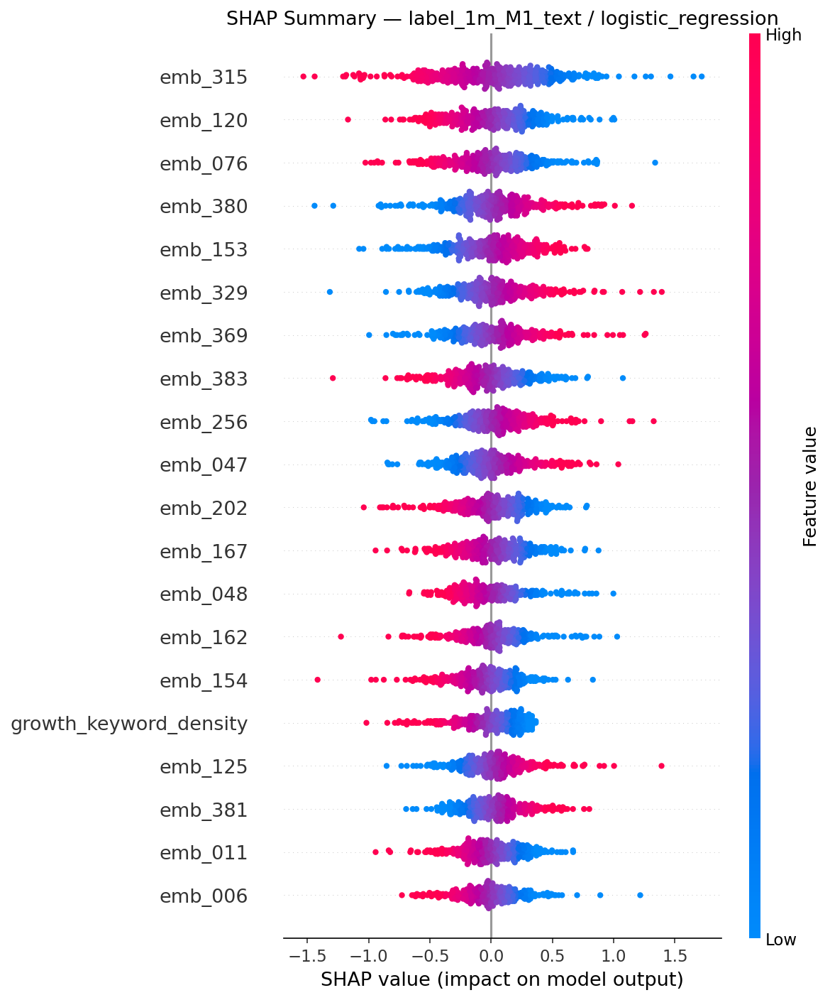

**M1_text/ridge**

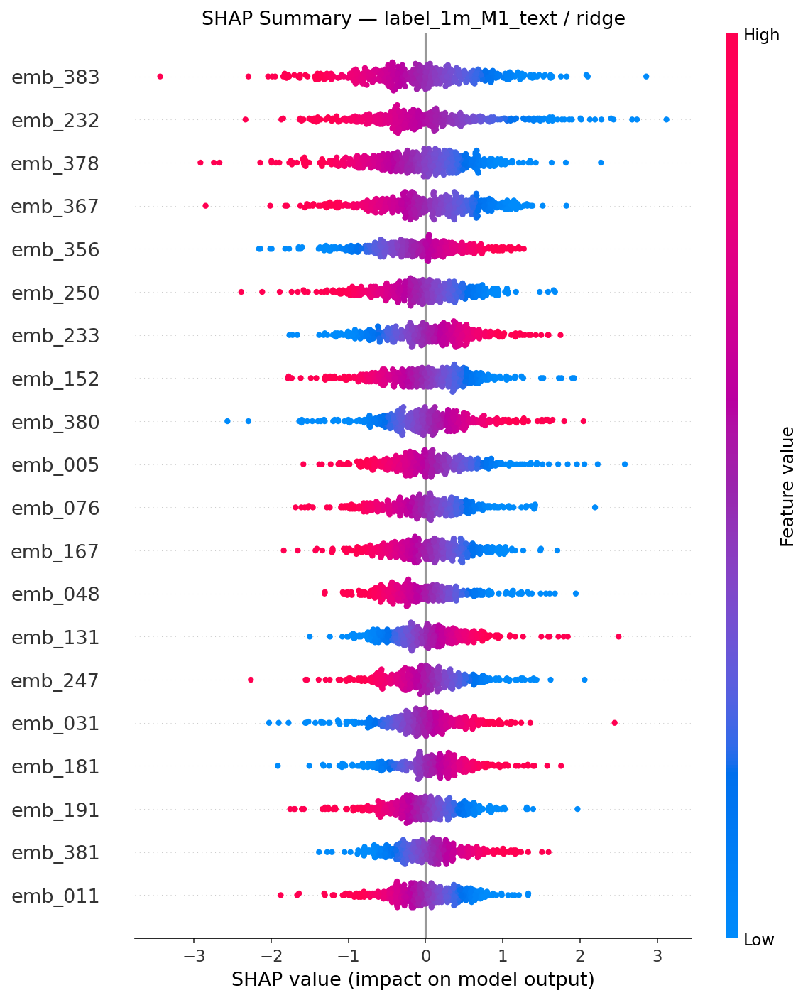

**M1_text/random_forest**

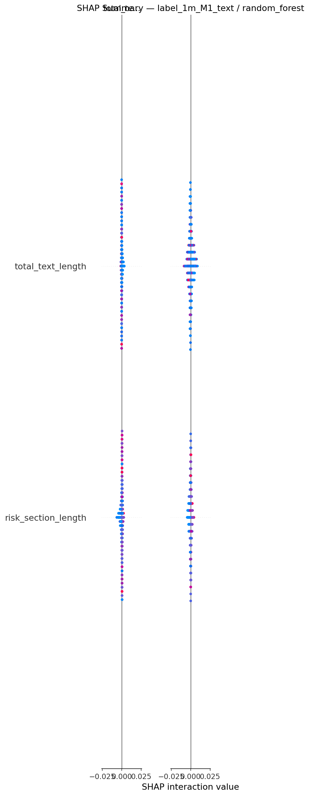

**M1_text/xgboost**

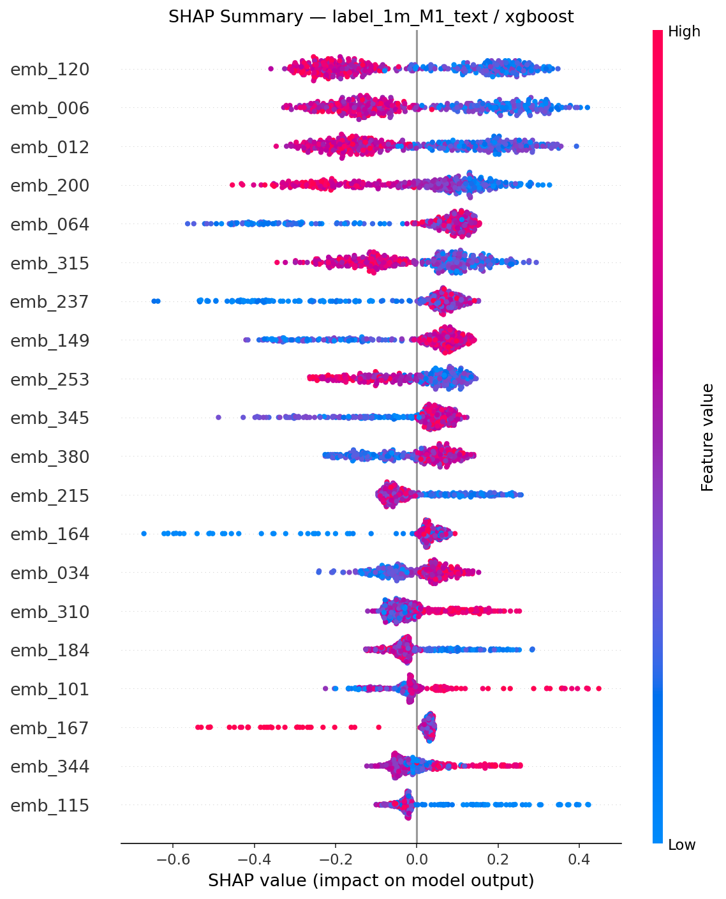

**M2_multiples/logistic_regression**

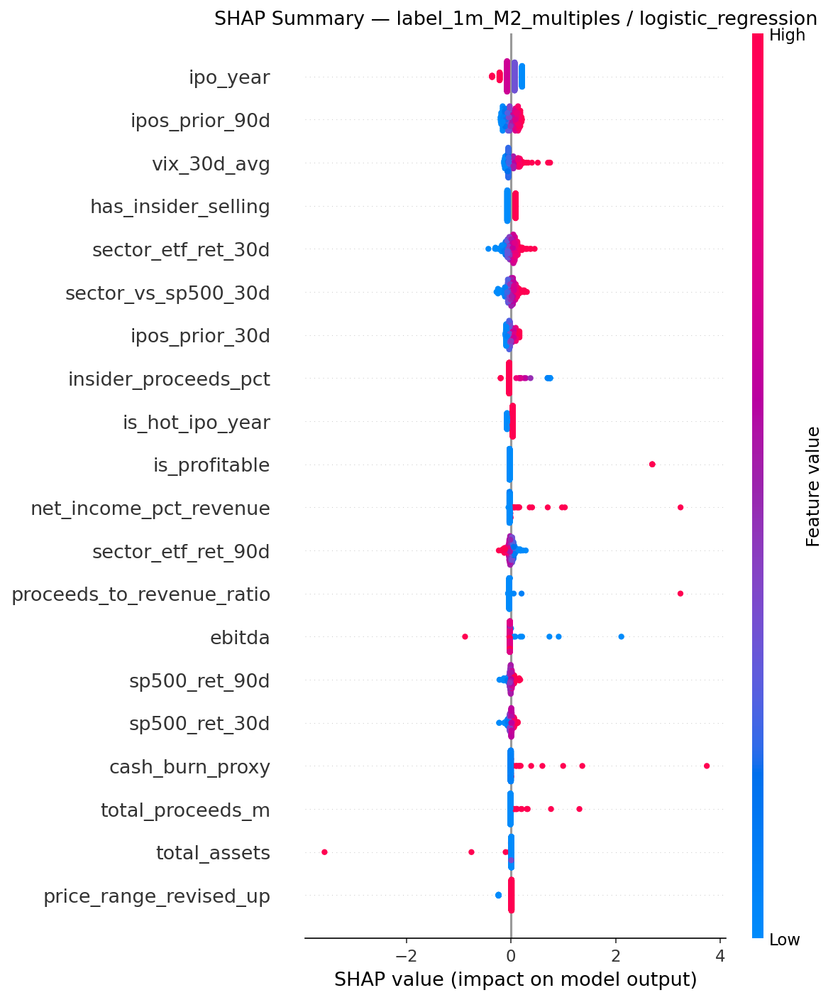

**M2_multiples/ridge**

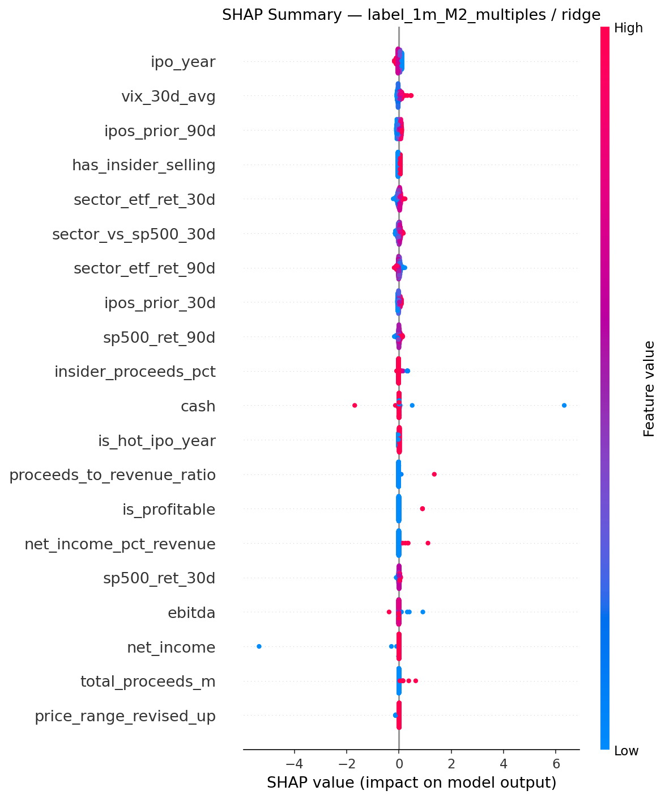

**M2_multiples/random_forest**

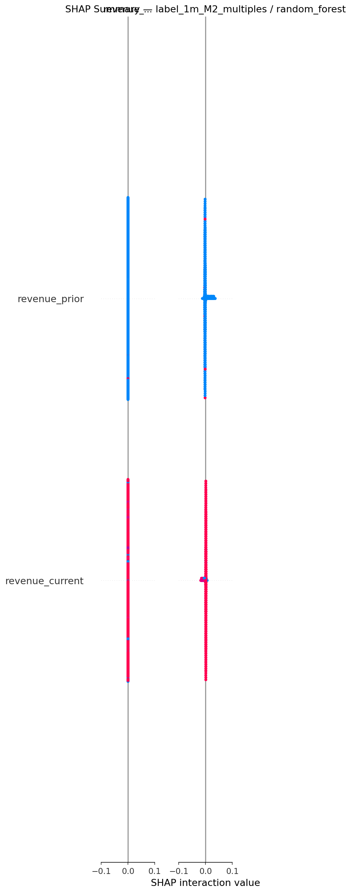

**M2_multiples/xgboost**

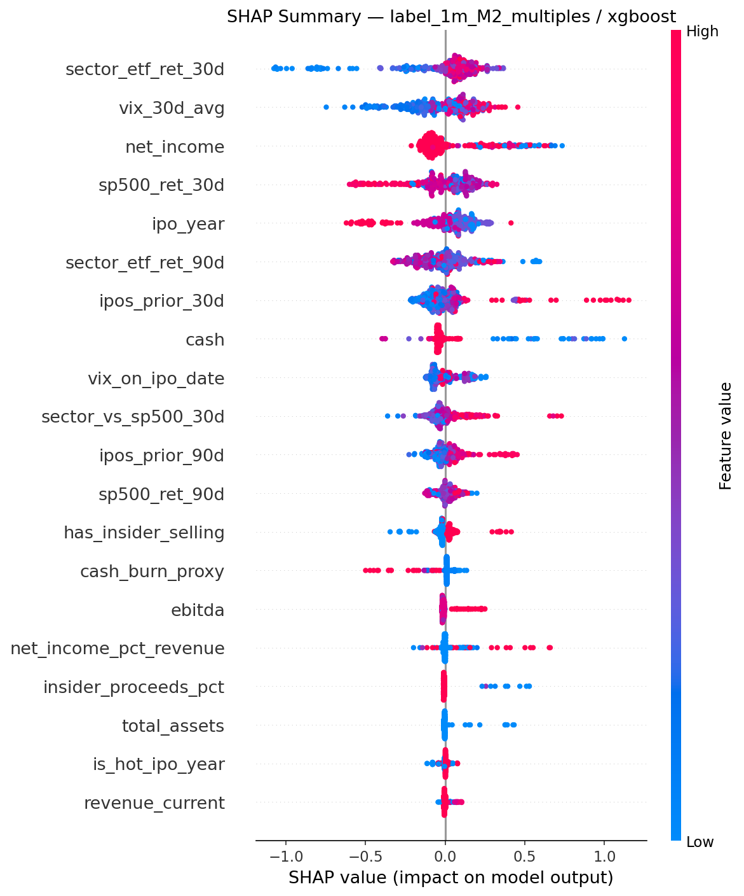

**M3_combined/logistic_regression**

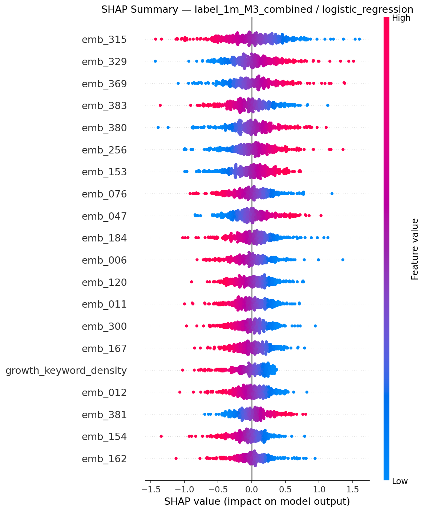

**M3_combined/ridge**

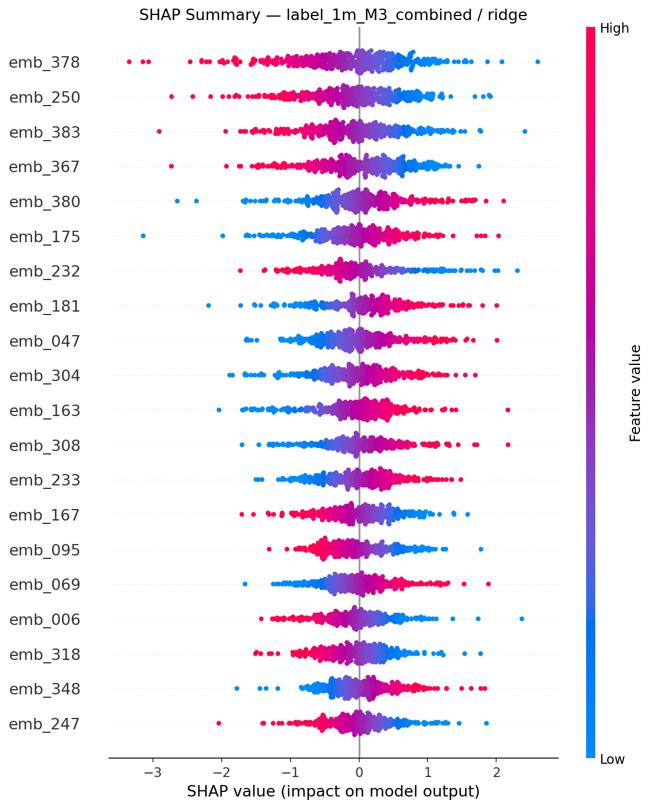

**M3_combined/random_forest**

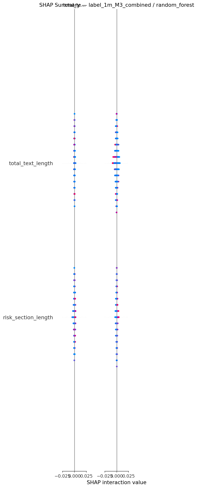

**M3_combined/xgboost**

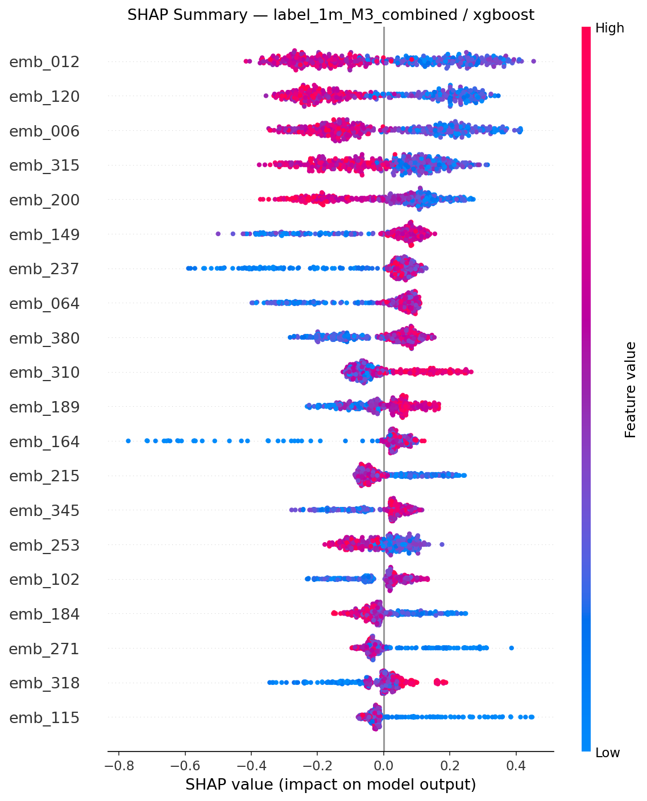

---

## Target: `label_6m`

Naive accuracy baseline: **65.9%**

| Variant | Model | ROC-AUC | ± | Bal-Accuracy | ± | Pred +% | N |
|---------|-------|---------|---|-------------|---|---------|---|
| M1_text | logistic_regression | 0.592 | 0.022 | 0.551 | 0.032 | 39.5% | 425 |
| M1_text | ridge | 0.558 | 0.033 | 0.509 | 0.040 | 40.9% | 425 |
| M1_text | random_forest | 0.608 | 0.044 | 0.549 | 0.018 | 17.6% | 425 |
| M1_text | xgboost | 0.630 | 0.055 | 0.582 | 0.044 | 27.8% | 425 |
| M2_multiples | logistic_regression | 0.625 | 0.067 | 0.595 | 0.047 | 45.5% | 517 |
| M2_multiples | ridge | 0.621 | 0.066 | 0.548 | 0.009 | 12.6% | 517 |
| M2_multiples | random_forest | 0.679 | 0.057 | 0.634 | 0.039 | 32.9% | 517 |
| M2_multiples | xgboost | 0.637 | 0.042 | 0.606 | 0.023 | 37.1% | 517 |
| M3_combined | logistic_regression | 0.620 | 0.035 | 0.569 | 0.032 | 37.2% | 425 |
| M3_combined | ridge | 0.559 | 0.034 | 0.521 | 0.040 | 40.7% | 425 |
| M3_combined | random_forest | 0.679 | 0.052 | 0.631 | 0.021 | 20.0% | 425 |
| M3_combined | xgboost | 0.726 | 0.033 | 0.672 | 0.042 | 32.5% | 425 |

### Top Features

### M1_text

**logistic_regression** — top 10 features:

| Rank | Feature | Importance |
|------|---------|------------|
| 1 | `emb_026` | 0.4144 |
| 2 | `emb_235` | 0.3532 |
| 3 | `risk_factor_count_approx` | 0.3313 |
| 4 | `emb_172` | 0.3168 |
| 5 | `emb_118` | 0.3129 |
| 6 | `emb_345` | 0.3047 |
| 7 | `emb_353` | 0.3047 |
| 8 | `emb_323` | 0.2973 |
| 9 | `emb_371` | 0.2964 |
| 10 | `emb_011` | 0.2909 |

**ridge** — top 10 features:

| Rank | Feature | Importance |
|------|---------|------------|
| 1 | `emb_250` | 0.7369 |
| 2 | `emb_221` | 0.6769 |
| 3 | `emb_279` | 0.6738 |
| 4 | `emb_353` | 0.6733 |
| 5 | `emb_217` | 0.6455 |
| 6 | `emb_182` | 0.6169 |
| 7 | `emb_041` | 0.5555 |
| 8 | `emb_095` | 0.5301 |
| 9 | `emb_311` | 0.5134 |
| 10 | `emb_174` | 0.5127 |

**random_forest** — top 10 features:

| Rank | Feature | Importance |
|------|---------|------------|
| 1 | `emb_288` | 0.0119 |
| 2 | `emb_367` | 0.0110 |
| 3 | `emb_189` | 0.0108 |
| 4 | `emb_279` | 0.0093 |
| 5 | `emb_198` | 0.0090 |
| 6 | `emb_280` | 0.0084 |
| 7 | `emb_006` | 0.0079 |
| 8 | `emb_004` | 0.0078 |
| 9 | `emb_323` | 0.0075 |
| 10 | `emb_166` | 0.0072 |

**xgboost** — top 10 features:

| Rank | Feature | Importance |
|------|---------|------------|
| 1 | `emb_288` | 0.0099 |
| 2 | `emb_155` | 0.0099 |
| 3 | `emb_358` | 0.0093 |
| 4 | `emb_143` | 0.0093 |
| 5 | `emb_214` | 0.0092 |
| 6 | `emb_367` | 0.0090 |
| 7 | `emb_189` | 0.0087 |
| 8 | `emb_121` | 0.0083 |
| 9 | `emb_218` | 0.0079 |
| 10 | `emb_223` | 0.0078 |

### M2_multiples

**logistic_regression** — top 10 features:

| Rank | Feature | Importance |
|------|---------|------------|
| 1 | `vix_30d_avg` | 0.3622 |
| 2 | `ipo_year` | 0.3572 |
| 3 | `has_insider_selling` | 0.2051 |
| 4 | `ipos_prior_90d` | 0.1881 |
| 5 | `total_assets` | 0.1780 |
| 6 | `revenue_prior` | 0.1517 |
| 7 | `proceeds_to_revenue_ratio` | 0.1510 |
| 8 | `gross_profit` | 0.1373 |
| 9 | `ebitda` | 0.1309 |
| 10 | `sp500_ret_90d` | 0.1293 |

**ridge** — top 10 features:

| Rank | Feature | Importance |
|------|---------|------------|
| 1 | `cash` | 0.2760 |
| 2 | `net_income` | 0.2367 |
| 3 | `vix_30d_avg` | 0.1909 |
| 4 | `ipo_year` | 0.1588 |
| 5 | `has_insider_selling` | 0.0948 |
| 6 | `ipos_prior_90d` | 0.0854 |
| 7 | `total_assets` | 0.0791 |
| 8 | `proceeds_to_revenue_ratio` | 0.0733 |
| 9 | `sp500_ret_90d` | 0.0700 |
| 10 | `is_hot_ipo_year` | 0.0657 |

**random_forest** — top 10 features:

| Rank | Feature | Importance |
|------|---------|------------|
| 1 | `ipo_year` | 0.1388 |
| 2 | `vix_30d_avg` | 0.1317 |
| 3 | `vix_on_ipo_date` | 0.1085 |
| 4 | `ipos_prior_90d` | 0.0888 |
| 5 | `sector_etf_ret_90d` | 0.0801 |
| 6 | `sp500_ret_90d` | 0.0782 |
| 7 | `sector_etf_ret_30d` | 0.0708 |
| 8 | `sector_vs_sp500_30d` | 0.0699 |
| 9 | `sp500_ret_30d` | 0.0580 |
| 10 | `ipos_prior_30d` | 0.0524 |

**xgboost** — top 10 features:

| Rank | Feature | Importance |
|------|---------|------------|
| 1 | `ipo_year` | 0.2821 |
| 2 | `vix_30d_avg` | 0.0630 |
| 3 | `sp500_ret_90d` | 0.0557 |
| 4 | `sector_etf_ret_90d` | 0.0501 |
| 5 | `insider_proceeds_pct` | 0.0470 |
| 6 | `sector_vs_sp500_30d` | 0.0458 |
| 7 | `ipos_prior_90d` | 0.0425 |
| 8 | `cash_burn_proxy` | 0.0421 |
| 9 | `sp500_ret_30d` | 0.0382 |
| 10 | `net_income_pct_revenue` | 0.0377 |

### M3_combined

**logistic_regression** — top 10 features:

| Rank | Feature | Importance |
|------|---------|------------|
| 1 | `vix_30d_avg` | 0.4532 |
| 2 | `emb_026` | 0.4095 |
| 3 | `ipo_year` | 0.4033 |
| 4 | `emb_165` | 0.3417 |
| 5 | `emb_345` | 0.3286 |
| 6 | `emb_340` | 0.3058 |
| 7 | `emb_160` | 0.3042 |
| 8 | `emb_235` | 0.3026 |
| 9 | `risk_factor_count_approx` | 0.3019 |
| 10 | `uncertainty_in_risk` | 0.2997 |

**ridge** — top 10 features:

| Rank | Feature | Importance |
|------|---------|------------|
| 1 | `emb_250` | 0.8314 |
| 2 | `emb_353` | 0.6962 |
| 3 | `emb_217` | 0.5741 |
| 4 | `emb_095` | 0.5719 |
| 5 | `emb_232` | 0.5370 |
| 6 | `emb_084` | 0.5247 |
| 7 | `emb_369` | 0.5061 |
| 8 | `emb_311` | 0.5027 |
| 9 | `emb_191` | 0.4966 |
| 10 | `emb_225` | 0.4932 |

**random_forest** — top 10 features:

| Rank | Feature | Importance |
|------|---------|------------|
| 1 | `vix_30d_avg` | 0.0252 |
| 2 | `ipo_year` | 0.0186 |
| 3 | `vix_on_ipo_date` | 0.0185 |
| 4 | `emb_367` | 0.0094 |
| 5 | `emb_288` | 0.0082 |
| 6 | `emb_261` | 0.0077 |
| 7 | `emb_279` | 0.0076 |
| 8 | `emb_004` | 0.0073 |
| 9 | `emb_118` | 0.0070 |
| 10 | `sp500_ret_90d` | 0.0069 |

**xgboost** — top 10 features:

| Rank | Feature | Importance |
|------|---------|------------|
| 1 | `ipo_year` | 0.0153 |
| 2 | `vix_on_ipo_date` | 0.0114 |
| 3 | `emb_127` | 0.0093 |
| 4 | `risk_to_total_ratio` | 0.0093 |
| 5 | `emb_192` | 0.0092 |
| 6 | `emb_223` | 0.0092 |
| 7 | `emb_145` | 0.0088 |
| 8 | `emb_266` | 0.0087 |
| 9 | `emb_301` | 0.0086 |
| 10 | `emb_070` | 0.0086 |

### Signal Interpretation

**xgboost:**

- M1 (text only): ROC-AUC = 0.630
- M2 (fundamentals only): ROC-AUC = 0.637
- M3 (combined): ROC-AUC = 0.726

**Text adds signal:** M3 outperforms M2 by +0.089 AUC, suggesting filing language contains predictive information beyond financials.
Best variant achieves 0.726 AUC — meaningfully above the 0.5 random baseline.

**logistic_regression:**

- M1 (text only): ROC-AUC = 0.592
- M2 (fundamentals only): ROC-AUC = 0.625
- M3 (combined): ROC-AUC = 0.620

**Mixed result:** Text adds marginal lift (-0.005 AUC). With a larger corpus the signal may become clearer.
Best variant achieves 0.625 AUC — modest lift above random. Consider expanding the IPO universe for stronger signal.

### Notable Findings

- **`emb_026`** is the #1 feature in **M1_text/logistic_regression** (importance: 0.4144)
- **`emb_250`** is the #1 feature in **M1_text/ridge** (importance: 0.7369)
- **`emb_288`** is the #1 feature in **M1_text/random_forest** (importance: 0.0119)
- **`vix_30d_avg`** is the #1 feature in **M2_multiples/logistic_regression** (importance: 0.3622)
- **`cash`** is the #1 feature in **M2_multiples/ridge** (importance: 0.2760)
- **`ipo_year`** is the #1 feature in **M2_multiples/random_forest** (importance: 0.1388)

### SHAP Plots

**M1_text/logistic_regression**

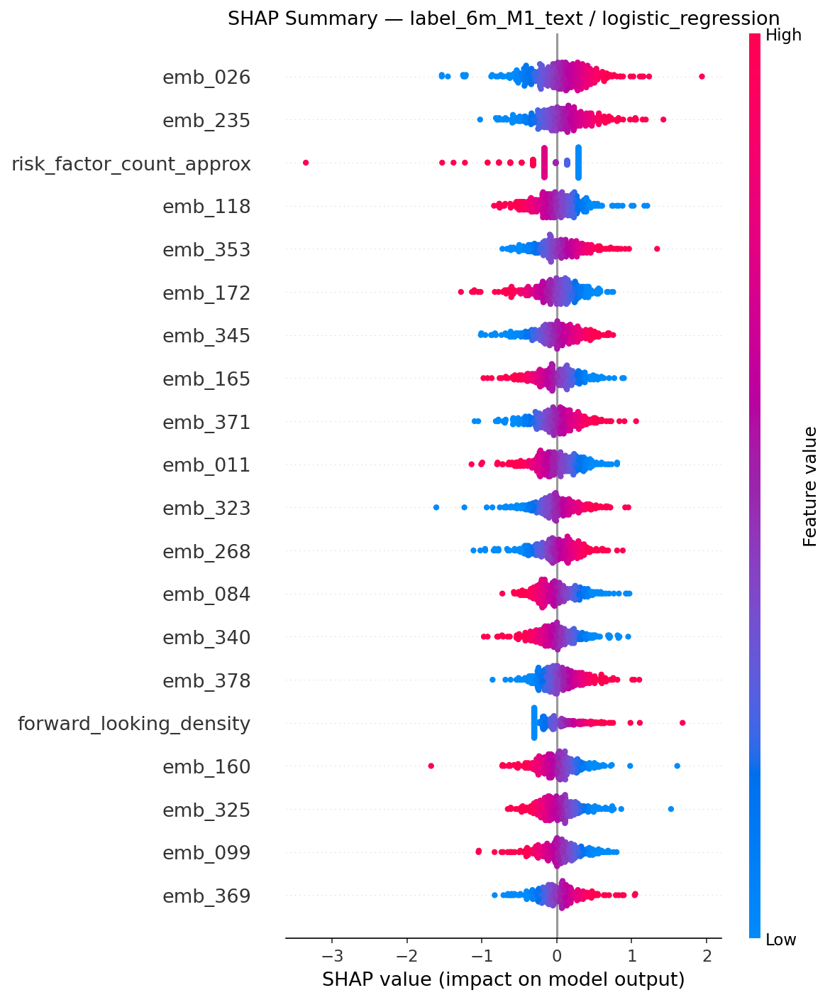

**M1_text/ridge**

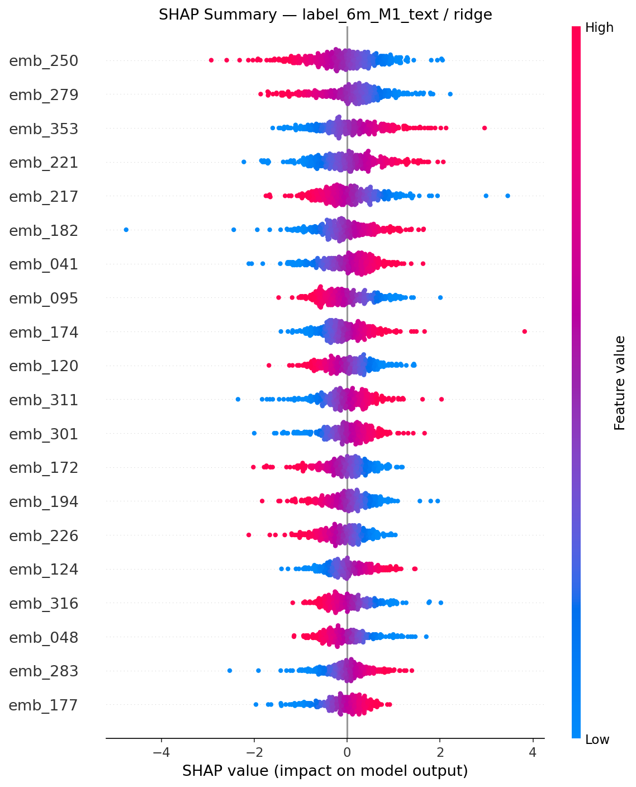

**M1_text/random_forest**

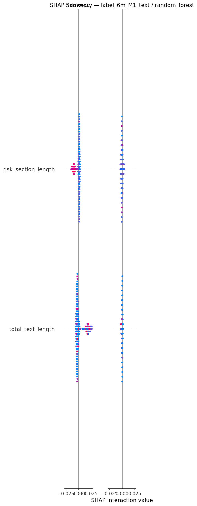

**M1_text/xgboost**

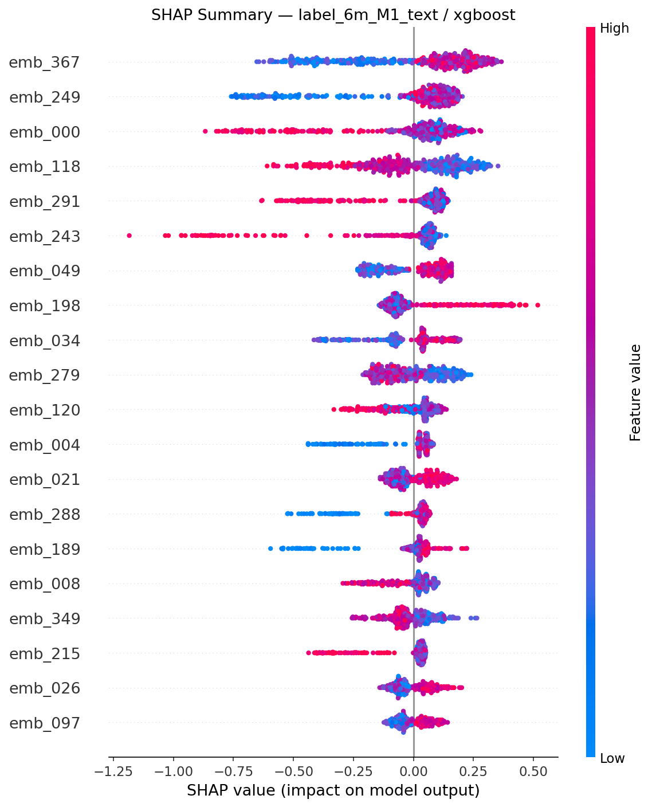

**M2_multiples/logistic_regression**

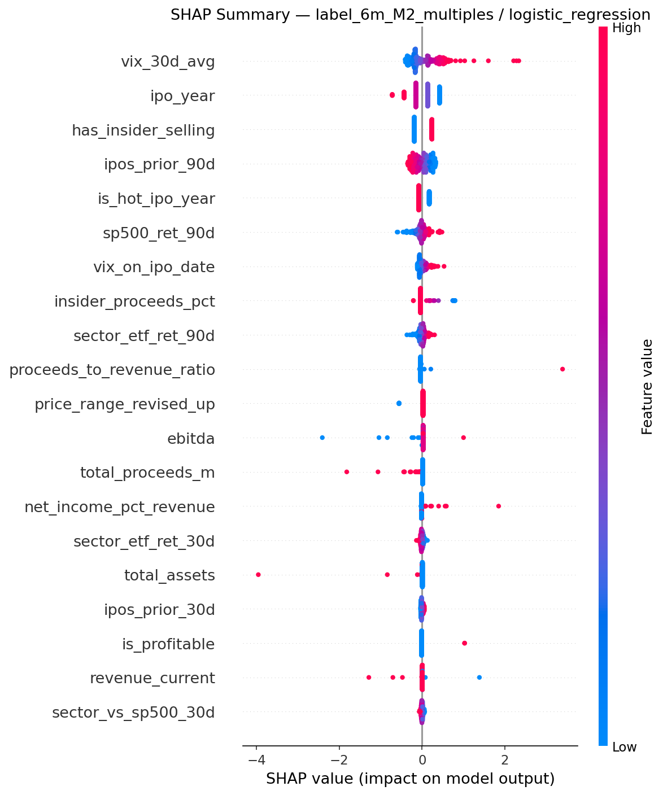

**M2_multiples/ridge**

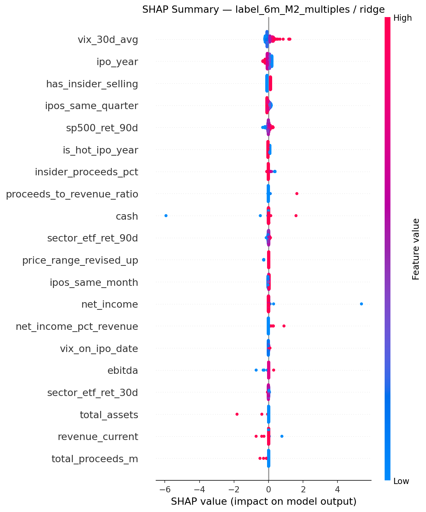

**M2_multiples/random_forest**

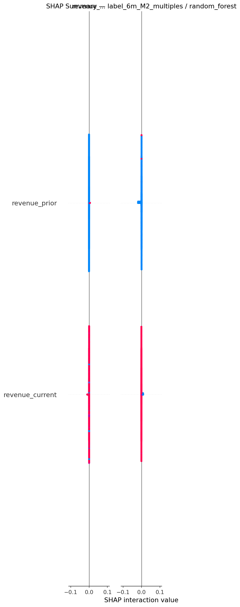

**M2_multiples/xgboost**

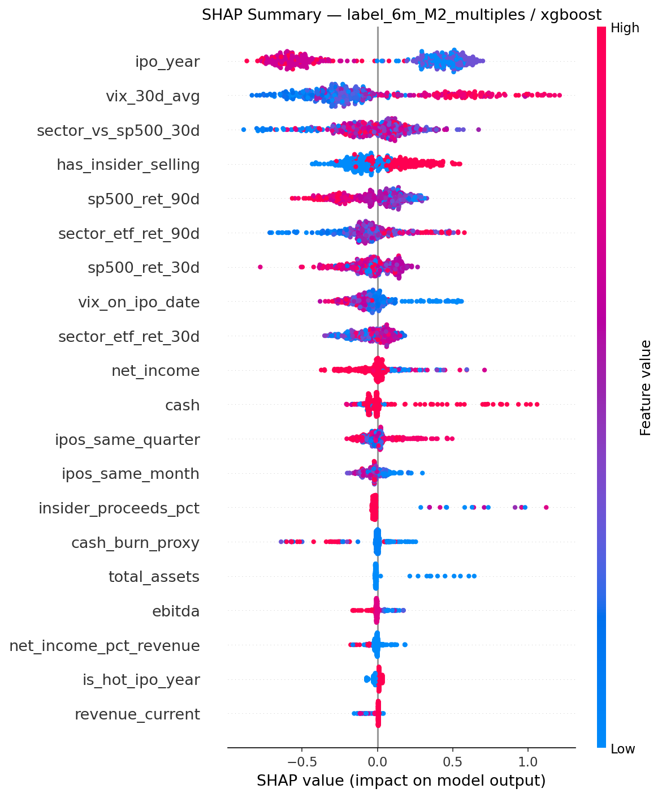

**M3_combined/logistic_regression**

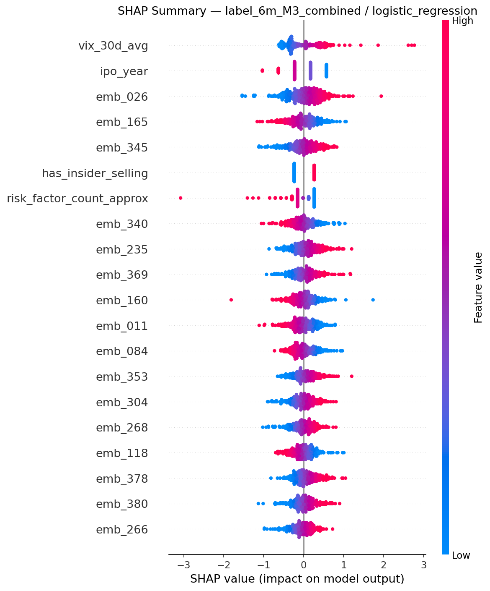

**M3_combined/ridge**

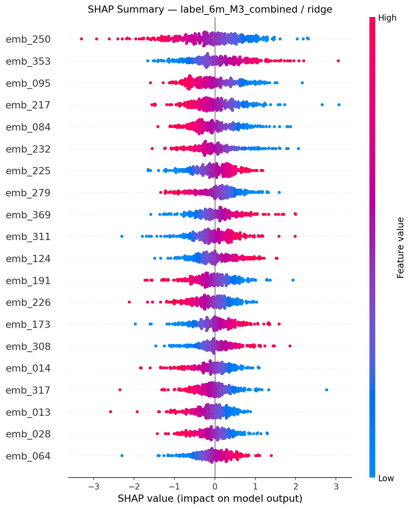

**M3_combined/random_forest**

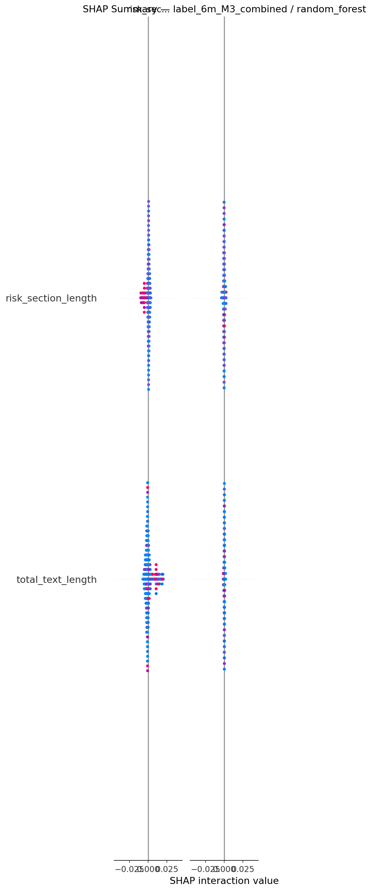

**M3_combined/xgboost**

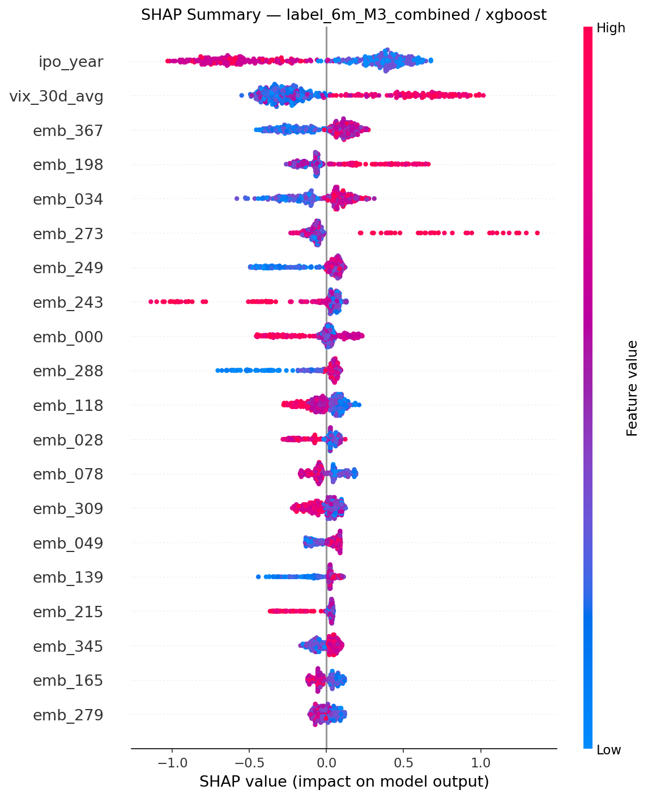

---

## Target: `label_1y`

Naive accuracy baseline: **69.2%**

| Variant | Model | ROC-AUC | ± | Bal-Accuracy | ± | Pred +% | N |
|---------|-------|---------|---|-------------|---|---------|---|
| M1_text | logistic_regression | 0.644 | 0.064 | 0.578 | 0.050 | 35.1% | 425 |
| M1_text | ridge | 0.587 | 0.050 | 0.550 | 0.037 | 38.8% | 425 |
| M1_text | random_forest | 0.649 | 0.072 | 0.528 | 0.037 | 10.6% | 425 |
| M1_text | xgboost | 0.605 | 0.051 | 0.553 | 0.021 | 20.9% | 425 |
| M2_multiples | logistic_regression | 0.681 | 0.060 | 0.641 | 0.044 | 47.6% | 517 |
| M2_multiples | ridge | 0.689 | 0.059 | 0.581 | 0.032 | 14.9% | 517 |
| M2_multiples | random_forest | 0.690 | 0.042 | 0.633 | 0.023 | 34.0% | 517 |
| M2_multiples | xgboost | 0.681 | 0.030 | 0.656 | 0.045 | 36.6% | 517 |
| M3_combined | logistic_regression | 0.689 | 0.073 | 0.605 | 0.055 | 35.8% | 425 |
| M3_combined | ridge | 0.606 | 0.051 | 0.574 | 0.044 | 36.9% | 425 |
| M3_combined | random_forest | 0.688 | 0.084 | 0.559 | 0.042 | 12.5% | 425 |
| M3_combined | xgboost | 0.671 | 0.039 | 0.629 | 0.035 | 29.4% | 425 |

### Top Features

### M1_text

**logistic_regression** — top 10 features:

| Rank | Feature | Importance |
|------|---------|------------|
| 1 | `emb_026` | 0.4664 |
| 2 | `n_sections_found` | 0.4507 |
| 3 | `emb_378` | 0.3388 |
| 4 | `emb_118` | 0.3322 |
| 5 | `emb_235` | 0.3108 |
| 6 | `emb_239` | 0.2963 |
| 7 | `emb_266` | 0.2818 |
| 8 | `uncertainty_density` | 0.2758 |
| 9 | `emb_262` | 0.2739 |
| 10 | `emb_264` | 0.2722 |

**ridge** — top 10 features:

| Rank | Feature | Importance |
|------|---------|------------|
| 1 | `emb_041` | 0.6163 |
| 2 | `emb_353` | 0.5999 |
| 3 | `emb_050` | 0.5700 |
| 4 | `emb_250` | 0.5673 |
| 5 | `emb_002` | 0.5554 |
| 6 | `emb_198` | 0.5518 |
| 7 | `emb_065` | 0.5462 |
| 8 | `emb_265` | 0.5419 |
| 9 | `emb_285` | 0.5377 |
| 10 | `emb_272` | 0.5186 |

**random_forest** — top 10 features:

| Rank | Feature | Importance |
|------|---------|------------|
| 1 | `emb_120` | 0.0103 |
| 2 | `emb_030` | 0.0100 |
| 3 | `emb_249` | 0.0084 |
| 4 | `emb_118` | 0.0083 |
| 5 | `emb_282` | 0.0083 |
| 6 | `emb_189` | 0.0080 |
| 7 | `risk_to_total_ratio` | 0.0080 |
| 8 | `emb_291` | 0.0074 |
| 9 | `emb_273` | 0.0071 |
| 10 | `emb_232` | 0.0070 |

**xgboost** — top 10 features:

| Rank | Feature | Importance |
|------|---------|------------|
| 1 | `emb_074` | 0.0109 |
| 2 | `emb_275` | 0.0103 |
| 3 | `emb_362` | 0.0103 |
| 4 | `emb_280` | 0.0091 |
| 5 | `emb_232` | 0.0080 |
| 6 | `emb_010` | 0.0080 |
| 7 | `emb_269` | 0.0080 |
| 8 | `emb_283` | 0.0079 |
| 9 | `emb_026` | 0.0079 |
| 10 | `emb_036` | 0.0078 |

### M2_multiples

**logistic_regression** — top 10 features:

| Rank | Feature | Importance |
|------|---------|------------|
| 1 | `ipo_year` | 0.4269 |
| 2 | `vix_30d_avg` | 0.3620 |
| 3 | `ipos_prior_30d` | 0.3166 |
| 4 | `is_hot_ipo_year` | 0.3131 |
| 5 | `has_insider_selling` | 0.2756 |
| 6 | `sp500_ret_90d` | 0.2383 |
| 7 | `total_assets` | 0.2089 |
| 8 | `revenue_prior` | 0.1739 |
| 9 | `ebitda` | 0.1655 |
| 10 | `proceeds_to_revenue_ratio` | 0.1519 |

**ridge** — top 10 features:

| Rank | Feature | Importance |
|------|---------|------------|
| 1 | `cash` | 0.3195 |
| 2 | `net_income` | 0.2855 |
| 3 | `vix_30d_avg` | 0.2020 |
| 4 | `ipo_year` | 0.1869 |
| 5 | `is_hot_ipo_year` | 0.1437 |
| 6 | `has_insider_selling` | 0.1169 |
| 7 | `sp500_ret_90d` | 0.1154 |
| 8 | `ipos_prior_30d` | 0.0938 |
| 9 | `revenue_current` | 0.0811 |
| 10 | `total_assets` | 0.0800 |

**random_forest** — top 10 features:

| Rank | Feature | Importance |
|------|---------|------------|
| 1 | `ipo_year` | 0.1455 |
| 2 | `ipos_prior_90d` | 0.1209 |
| 3 | `ipos_prior_30d` | 0.0984 |
| 4 | `vix_30d_avg` | 0.0858 |
| 5 | `vix_on_ipo_date` | 0.0814 |
| 6 | `sector_etf_ret_30d` | 0.0800 |
| 7 | `sp500_ret_30d` | 0.0714 |
| 8 | `sp500_ret_90d` | 0.0623 |
| 9 | `sector_vs_sp500_30d` | 0.0599 |
| 10 | `sector_etf_ret_90d` | 0.0578 |

**xgboost** — top 10 features:

| Rank | Feature | Importance |
|------|---------|------------|
| 1 | `ipo_year` | 0.2064 |
| 2 | `is_hot_ipo_year` | 0.0585 |
| 3 | `ipos_prior_90d` | 0.0542 |
| 4 | `ipos_prior_30d` | 0.0509 |
| 5 | `vix_on_ipo_date` | 0.0509 |
| 6 | `sp500_ret_30d` | 0.0445 |
| 7 | `vix_30d_avg` | 0.0415 |
| 8 | `ebitda` | 0.0406 |
| 9 | `sp500_ret_90d` | 0.0387 |
| 10 | `sector_vs_sp500_30d` | 0.0383 |

### M3_combined

**logistic_regression** — top 10 features:

| Rank | Feature | Importance |
|------|---------|------------|
| 1 | `is_hot_ipo_year` | 0.4454 |
| 2 | `emb_026` | 0.4427 |
| 3 | `n_sections_found` | 0.4000 |
| 4 | `ipo_year` | 0.3775 |
| 5 | `ipos_prior_30d` | 0.3442 |
| 6 | `vix_30d_avg` | 0.3414 |
| 7 | `profit_loss_ratio` | 0.3247 |
| 8 | `emb_266` | 0.3243 |
| 9 | `emb_264` | 0.3241 |
| 10 | `emb_065` | 0.3224 |

**ridge** — top 10 features:

| Rank | Feature | Importance |
|------|---------|------------|
| 1 | `emb_250` | 0.8166 |
| 2 | `emb_265` | 0.6322 |
| 3 | `emb_353` | 0.5913 |
| 4 | `emb_285` | 0.5212 |
| 5 | `emb_111` | 0.4987 |
| 6 | `emb_050` | 0.4978 |
| 7 | `emb_373` | 0.4970 |
| 8 | `emb_246` | 0.4885 |
| 9 | `emb_198` | 0.4650 |
| 10 | `emb_242` | 0.4608 |

**random_forest** — top 10 features:

| Rank | Feature | Importance |
|------|---------|------------|
| 1 | `ipo_year` | 0.0259 |
| 2 | `ipos_prior_30d` | 0.0191 |
| 3 | `ipos_prior_90d` | 0.0119 |
| 4 | `emb_030` | 0.0106 |
| 5 | `emb_282` | 0.0101 |
| 6 | `emb_028` | 0.0098 |
| 7 | `vix_30d_avg` | 0.0088 |
| 8 | `emb_120` | 0.0086 |
| 9 | `emb_189` | 0.0077 |
| 10 | `emb_343` | 0.0072 |

**xgboost** — top 10 features:

| Rank | Feature | Importance |
|------|---------|------------|
| 1 | `ipo_year` | 0.0167 |
| 2 | `emb_255` | 0.0111 |
| 3 | `emb_341` | 0.0102 |
| 4 | `emb_058` | 0.0098 |
| 5 | `emb_158` | 0.0098 |
| 6 | `emb_315` | 0.0095 |
| 7 | `emb_199` | 0.0091 |
| 8 | `emb_124` | 0.0086 |
| 9 | `emb_248` | 0.0086 |
| 10 | `emb_180` | 0.0084 |

### Signal Interpretation

**xgboost:**

- M1 (text only): ROC-AUC = 0.605
- M2 (fundamentals only): ROC-AUC = 0.681
- M3 (combined): ROC-AUC = 0.671

**Mixed result:** Text adds marginal lift (-0.009 AUC). With a larger corpus the signal may become clearer.
Best variant achieves 0.681 AUC — meaningfully above the 0.5 random baseline.

**logistic_regression:**

- M1 (text only): ROC-AUC = 0.644
- M2 (fundamentals only): ROC-AUC = 0.681
- M3 (combined): ROC-AUC = 0.689

**Mixed result:** Text adds marginal lift (+0.008 AUC). With a larger corpus the signal may become clearer.
Best variant achieves 0.689 AUC — meaningfully above the 0.5 random baseline.

### Notable Findings

- **`emb_026`** is the #1 feature in **M1_text/logistic_regression** (importance: 0.4664)
- **`emb_041`** is the #1 feature in **M1_text/ridge** (importance: 0.6163)
- **`emb_120`** is the #1 feature in **M1_text/random_forest** (importance: 0.0103)
- **`emb_074`** is the #1 feature in **M1_text/xgboost** (importance: 0.0109)
- **`ipo_year`** is the #1 feature in **M2_multiples/logistic_regression** (importance: 0.4269)
- **`cash`** is the #1 feature in **M2_multiples/ridge** (importance: 0.3195)
- **`is_hot_ipo_year`** is the #1 feature in **M3_combined/logistic_regression** (importance: 0.4454)
- **`emb_250`** is the #1 feature in **M3_combined/ridge** (importance: 0.8166)

### SHAP Plots

**M1_text/logistic_regression**

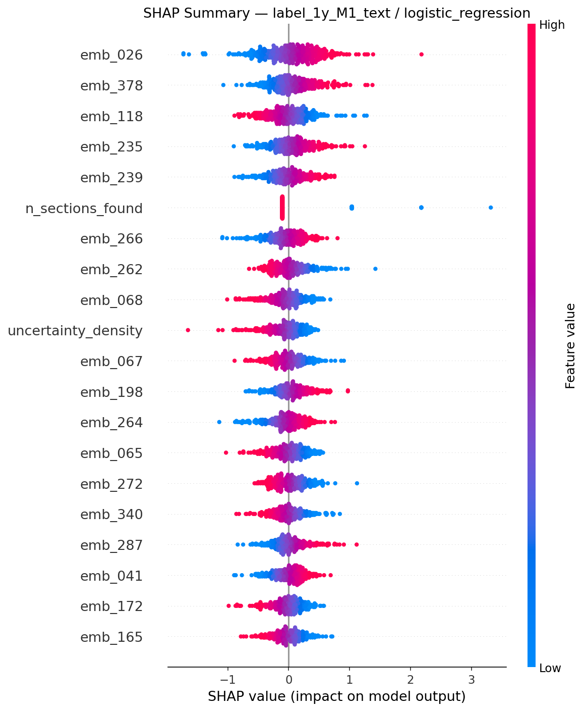

**M1_text/ridge**

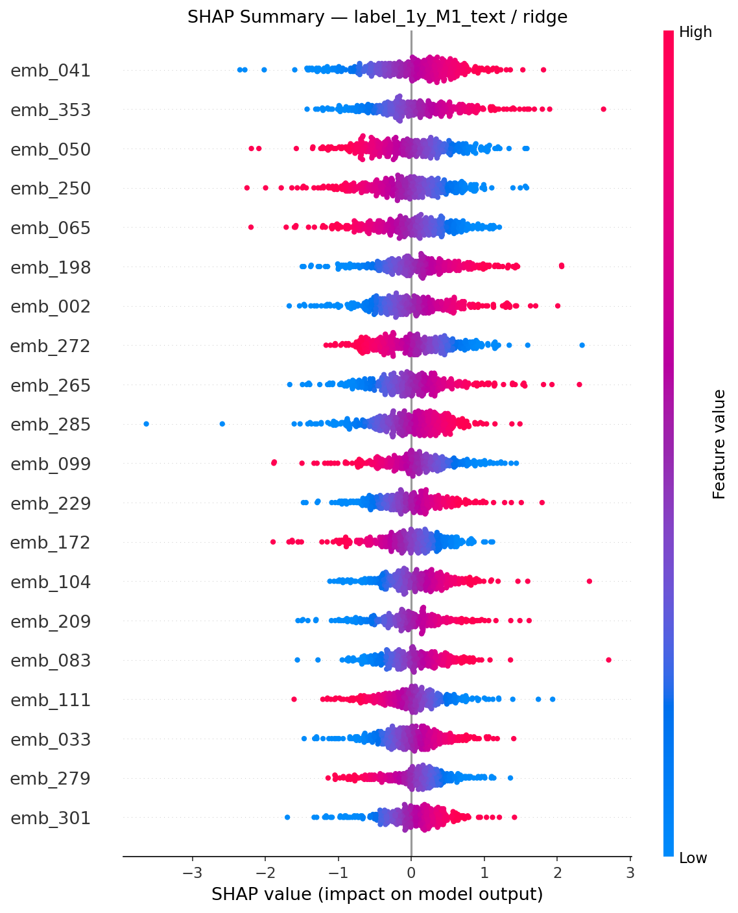

**M1_text/random_forest**

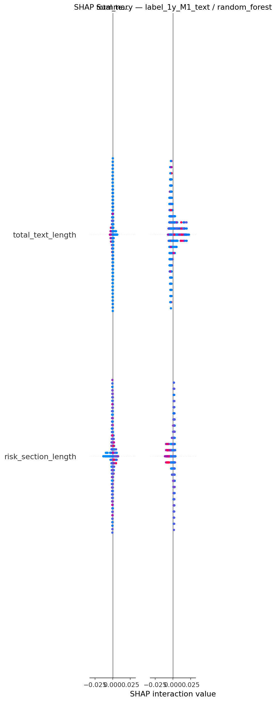

**M1_text/xgboost**

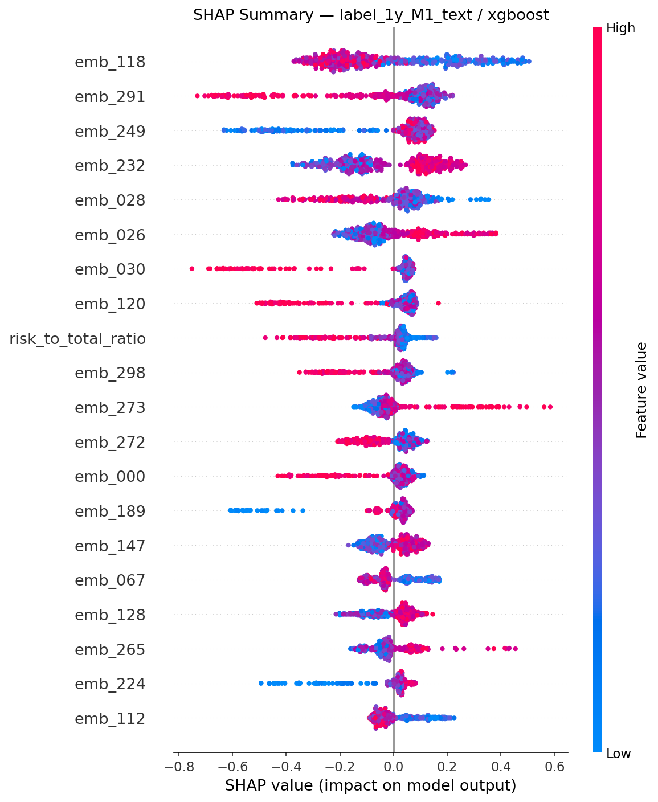

**M2_multiples/logistic_regression**

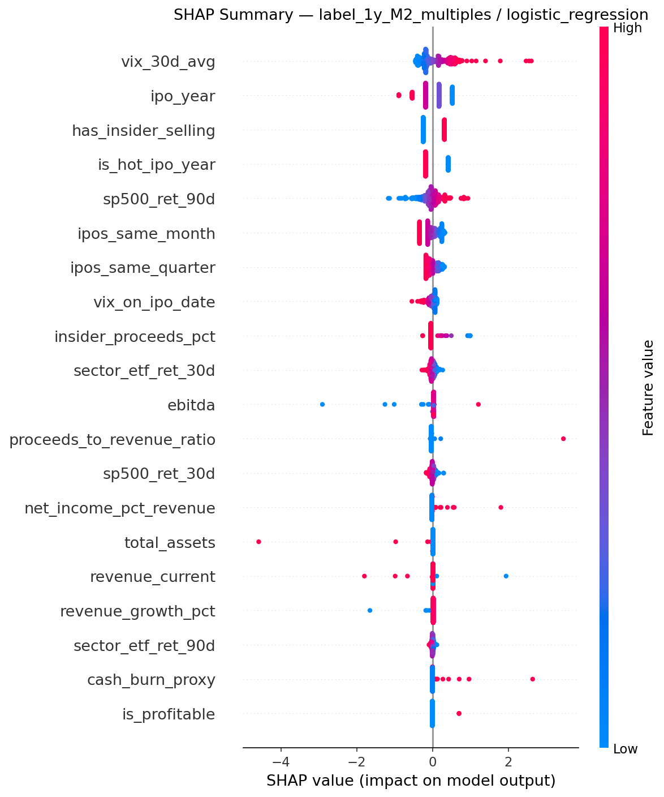

**M2_multiples/ridge**

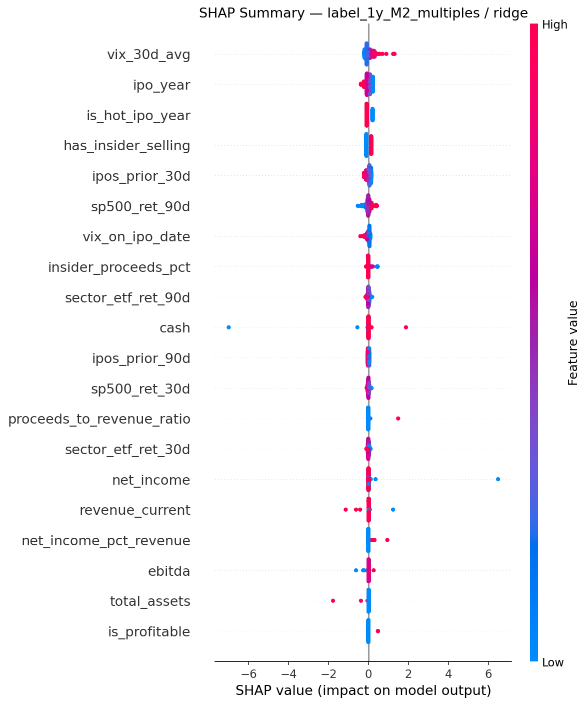

**M2_multiples/random_forest**

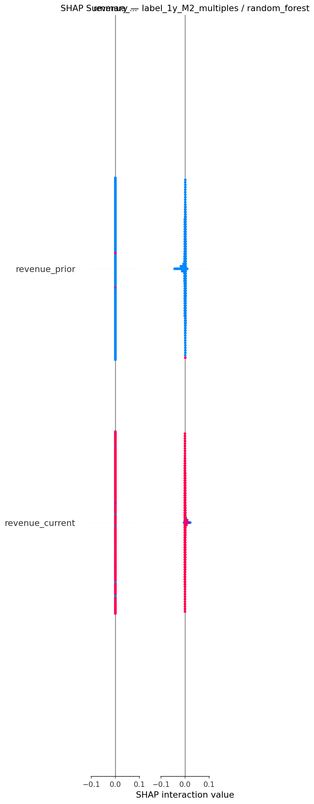

**M2_multiples/xgboost**

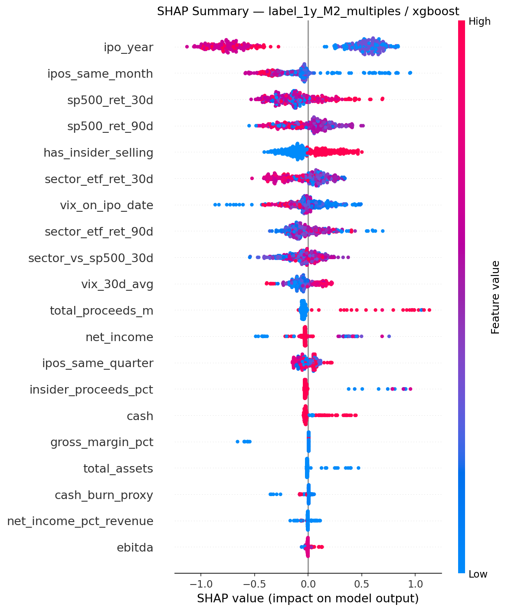

**M3_combined/logistic_regression**

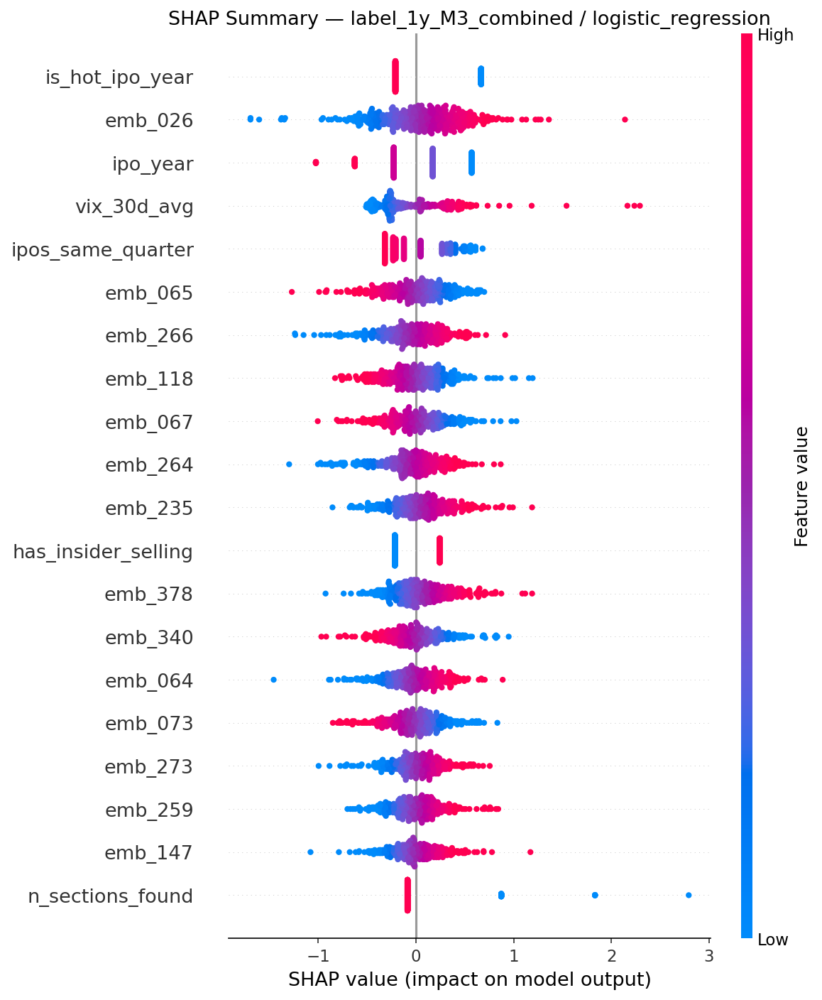

**M3_combined/ridge**

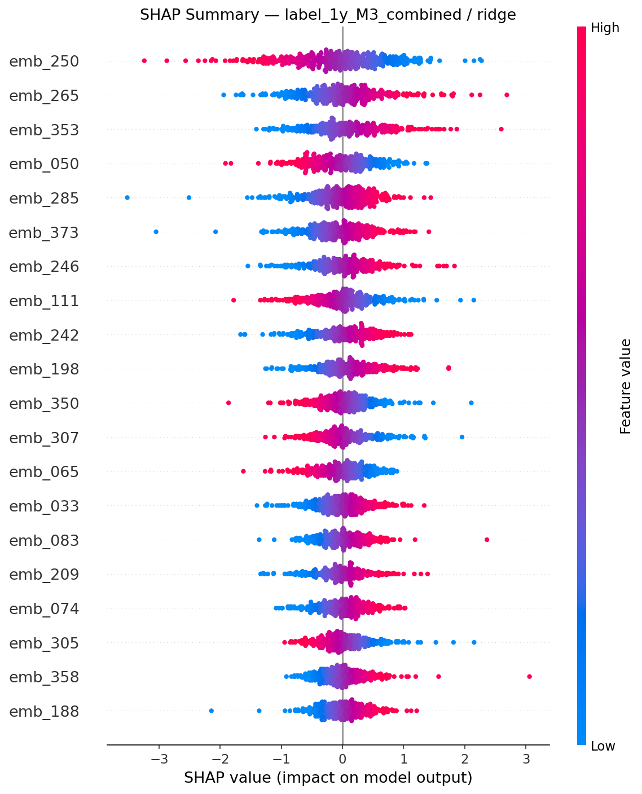

**M3_combined/random_forest**

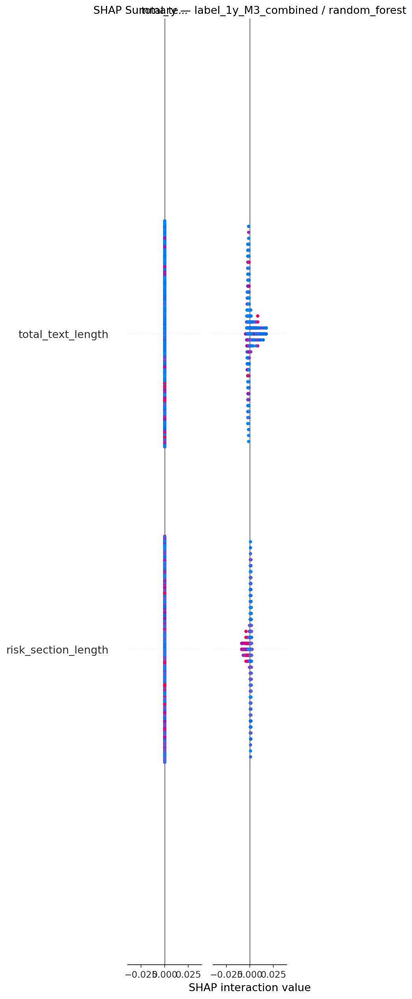

**M3_combined/xgboost**

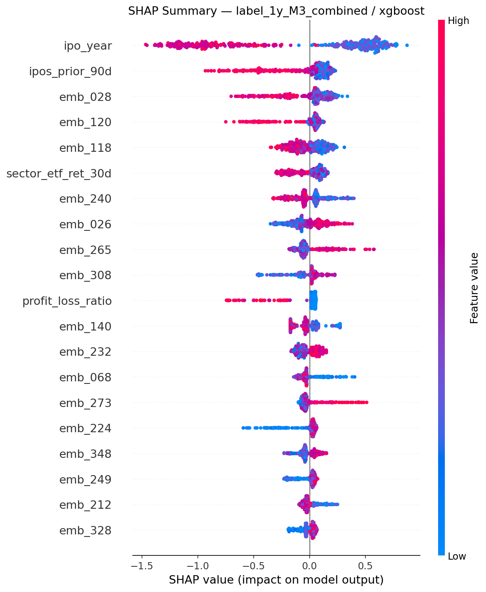
