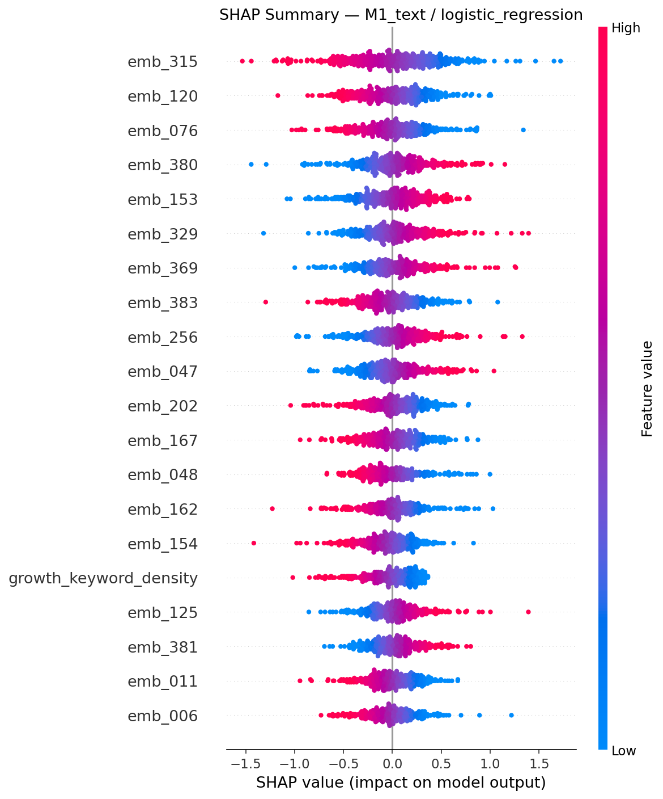
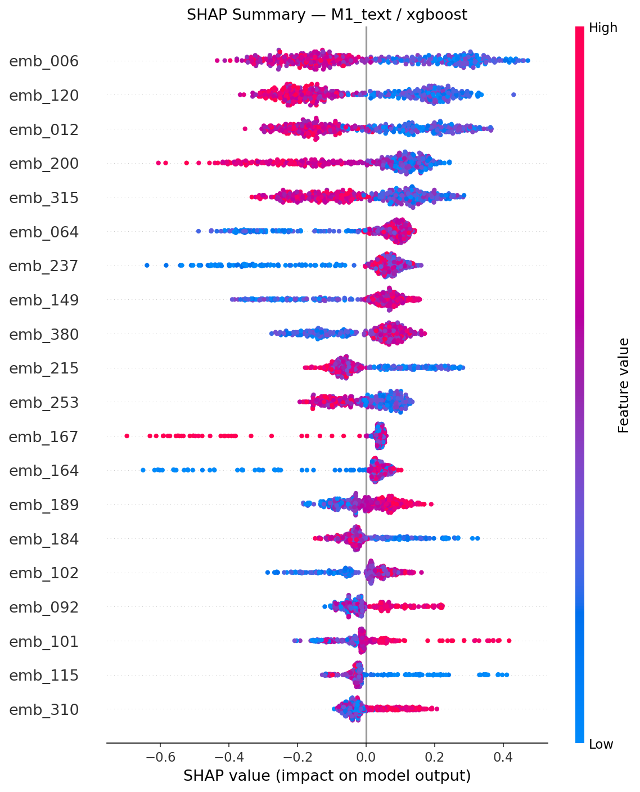
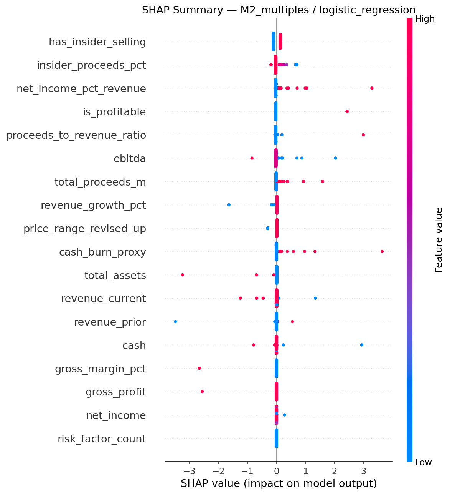
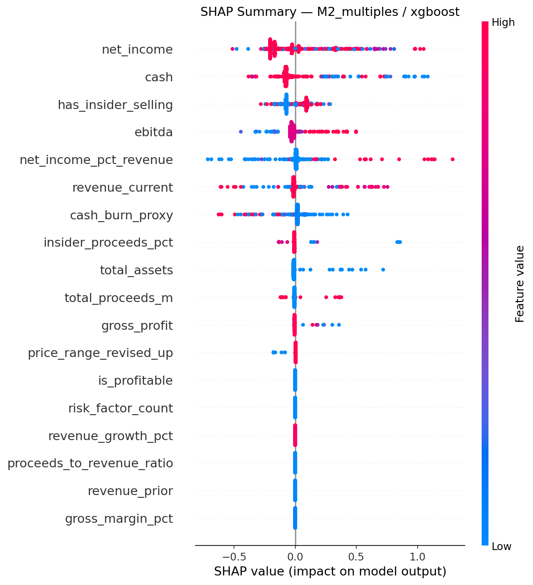
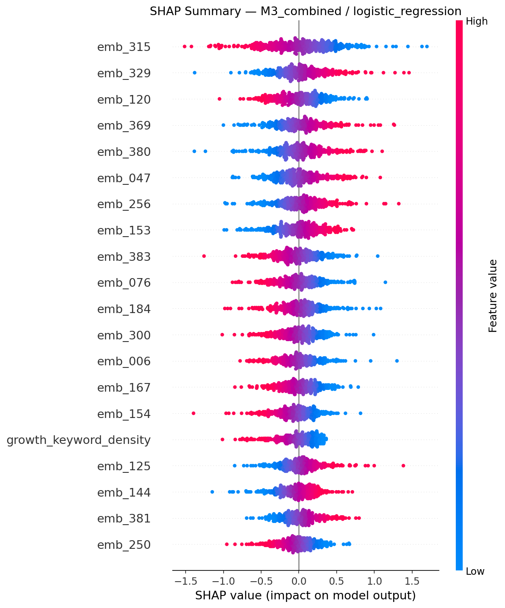
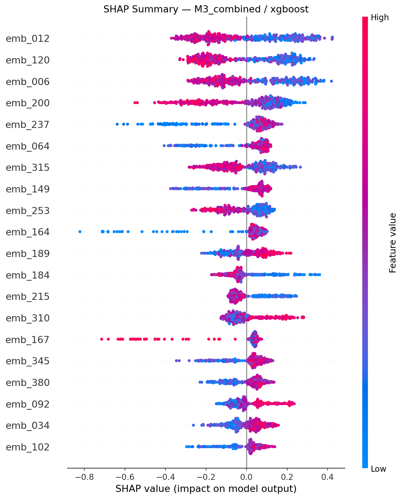

# IPO Language & Aftermarket Performance — Evaluation Report

**Target variable:** `label_1m` (binary: did the stock outperform median 1-month return?)
**Variants evaluated:** 3
**Cross-validation:** 5-fold stratified

---

## Model Comparison

| Variant | Model | ROC-AUC | ± | Accuracy | ± | N |
|---------|-------|---------|---|----------|---|---|
| M1_text | logistic_regression | 0.612 | 0.029 | 0.586 | 0.044 | 425 |
| M1_text | xgboost | 0.601 | 0.030 | 0.576 | 0.025 | 425 |
| M2_multiples | logistic_regression | 0.535 | 0.075 | 0.529 | 0.080 | 427 |
| M2_multiples | xgboost | 0.560 | 0.052 | 0.567 | 0.050 | 427 |
| M3_combined | logistic_regression | 0.615 | 0.038 | 0.584 | 0.033 | 425 |
| M3_combined | xgboost | 0.605 | 0.032 | 0.560 | 0.042 | 425 |

---

## Top Features by Variant

### M1_text

**logistic_regression** — top 10 features:

| Rank | Feature | Importance |
|------|---------|------------|
| 1 | `emb_315` | 0.4777 |
| 2 | `emb_380` | 0.3423 |
| 3 | `emb_120` | 0.3372 |
| 4 | `emb_076` | 0.3356 |
| 5 | `emb_329` | 0.3270 |
| 6 | `emb_369` | 0.3188 |
| 7 | `emb_153` | 0.3176 |
| 8 | `emb_256` | 0.3088 |
| 9 | `emb_383` | 0.3020 |
| 10 | `emb_047` | 0.2947 |

**xgboost** — top 10 features:

| Rank | Feature | Importance |
|------|---------|------------|
| 1 | `emb_073` | 0.0114 |
| 2 | `emb_054` | 0.0095 |
| 3 | `emb_175` | 0.0089 |
| 4 | `emb_064` | 0.0089 |
| 5 | `emb_136` | 0.0084 |
| 6 | `emb_092` | 0.0083 |
| 7 | `growth_keyword_density` | 0.0082 |
| 8 | `emb_110` | 0.0075 |
| 9 | `emb_273` | 0.0075 |
| 10 | `emb_038` | 0.0074 |

### M2_multiples

**logistic_regression** — top 10 features:

| Rank | Feature | Importance |
|------|---------|------------|
| 1 | `is_profitable` | 0.2052 |
| 2 | `cash_burn_proxy` | 0.1962 |
| 3 | `net_income_pct_revenue` | 0.1814 |
| 4 | `revenue_prior` | 0.1702 |
| 5 | `total_assets` | 0.1601 |
| 6 | `cash` | 0.1474 |
| 7 | `proceeds_to_revenue_ratio` | 0.1464 |
| 8 | `gross_margin_pct` | 0.1282 |
| 9 | `gross_profit` | 0.1235 |
| 10 | `ebitda` | 0.1214 |

**xgboost** — top 10 features:

| Rank | Feature | Importance |
|------|---------|------------|
| 1 | `cash` | 0.1135 |
| 2 | `ebitda` | 0.1096 |
| 3 | `net_income` | 0.1013 |
| 4 | `net_income_pct_revenue` | 0.0923 |
| 5 | `price_range_revised_up` | 0.0911 |
| 6 | `insider_proceeds_pct` | 0.0891 |
| 7 | `revenue_current` | 0.0854 |
| 8 | `cash_burn_proxy` | 0.0829 |
| 9 | `has_insider_selling` | 0.0694 |
| 10 | `total_proceeds_m` | 0.0649 |

### M3_combined

**logistic_regression** — top 10 features:

| Rank | Feature | Importance |
|------|---------|------------|
| 1 | `emb_315` | 0.4719 |
| 2 | `emb_329` | 0.3430 |
| 3 | `emb_380` | 0.3287 |
| 4 | `emb_369` | 0.3197 |
| 5 | `emb_256` | 0.3080 |
| 6 | `emb_047` | 0.3064 |
| 7 | `emb_120` | 0.3030 |
| 8 | `emb_383` | 0.2932 |
| 9 | `emb_153` | 0.2920 |
| 10 | `emb_076` | 0.2875 |

**xgboost** — top 10 features:

| Rank | Feature | Importance |
|------|---------|------------|
| 1 | `emb_073` | 0.0108 |
| 2 | `emb_002` | 0.0102 |
| 3 | `emb_064` | 0.0088 |
| 4 | `emb_206` | 0.0081 |
| 5 | `emb_136` | 0.0078 |
| 6 | `emb_340` | 0.0078 |
| 7 | `emb_006` | 0.0075 |
| 8 | `emb_200` | 0.0072 |
| 9 | `emb_038` | 0.0072 |
| 10 | `emb_268` | 0.0071 |

---

## Does Text Add Signal Over Fundamentals?

**Research question:** Does language in IPO filings (S-1 / 424B4) predict post-IPO returns
beyond what can be explained by structured financials alone?

**xgboost:**

- M1 (text only): ROC-AUC = 0.601
- M2 (fundamentals only): ROC-AUC = 0.560
- M3 (combined): ROC-AUC = 0.605

**Text adds signal:** M3 outperforms M2 by +0.044 AUC, suggesting filing language contains predictive information beyond financials.
Best variant achieves 0.605 AUC — modest lift above random. Consider expanding the IPO universe for stronger signal.

**logistic_regression:**

- M1 (text only): ROC-AUC = 0.612
- M2 (fundamentals only): ROC-AUC = 0.535
- M3 (combined): ROC-AUC = 0.615

**Text adds signal:** M3 outperforms M2 by +0.080 AUC, suggesting filing language contains predictive information beyond financials.
Best variant achieves 0.615 AUC — modest lift above random. Consider expanding the IPO universe for stronger signal.

---

## Notable Findings

- **`emb_315`** is the #1 feature in **M1_text/logistic_regression** (importance: 0.4777)
- **`emb_073`** is the #1 feature in **M1_text/xgboost** (importance: 0.0114)
- **`is_profitable`** is the #1 feature in **M2_multiples/logistic_regression** (importance: 0.2052)
- **`cash`** is the #1 feature in **M2_multiples/xgboost** (importance: 0.1135)

---

## SHAP Feature Importance Plots

### M1_text/logistic_regression

### M1_text/xgboost

### M2_multiples/logistic_regression

### M2_multiples/xgboost

### M3_combined/logistic_regression

### M3_combined/xgboost

## Methodology Notes

- **M1:** Text-only features — VADER sentiment, uncertainty keyword density, readability,
  forward-looking statement density, and sentence-transformer embeddings (all-MiniLM-L6-v2).
- **M2:** Structured financial features extracted from filing HTML — revenue growth, gross margin,
  profitability, cash burn, total proceeds, sector.
- **M3:** M1 + M2 combined — tests whether text and fundamentals are complementary.
- All variants use 5-fold stratified cross-validation. Means and standard deviations are reported
  to guard against overfitting on the small IPO sample.
- **Sample size caveat:** With <100 IPOs, results are noisy. Run the full pipeline with 200–500
  IPOs (via `data/raw/ipo_list_override.csv`) for reliable conclusions.
